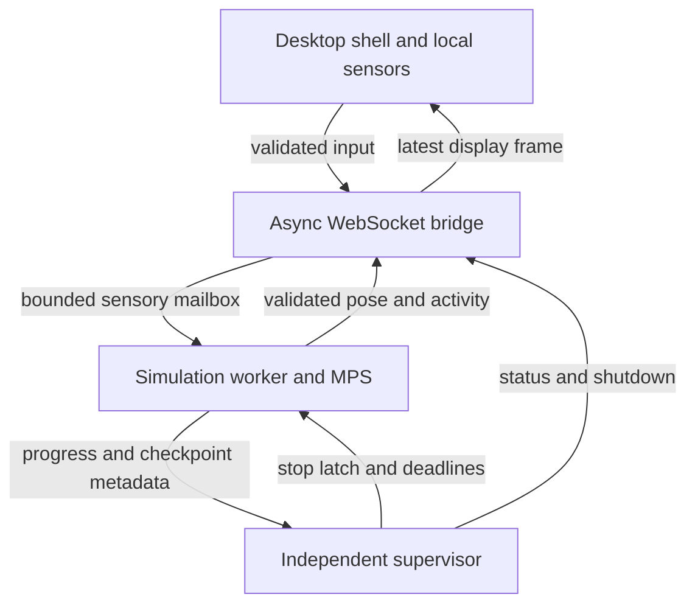

# Local fruit fly simulation — Cursor implementation handover

Prepared 16 September 2026. Target: Apple Silicon Mac, local execution, React/Three.js workbench, Python/PyTorch/PyTorch Geometric graph representation. This is an implementation specification and reference boilerplate, not a completed or biologically validated simulator.

Operator revision: plain-language software health, no biological needs or rewards, bounded automatic recovery for recognized problems, and explicit handling of uncertainty. The data-loading, neural mathematics, Mac execution, and communication foundations remain in place.

Desktop-pet revision: the primary product is a frameless, transparent, click-through fly that follows the user's selected window without taking keyboard focus. The workbench and health dashboard open only on request. Add surface-aware crawling, bounded visual depth and hiding, normal application menus, a menu-bar status icon, and a separate capability broker for future useful integrations. Preserve all neural constraints and the four-phase implementation sequence.

## Read first: corrected objective and assurance boundary

Build a **connectome-informed, bounded sensorimotor simulation** presented as a native-feeling macOS desktop pet. Its movement uses desktop coordinates, with an optional bounded visual depth axis for flight and occlusion. A transparent OS window carries only the fly's pixels; no visible frame, rectangular backdrop, or permanently open dashboard surrounds it. Treat connectomic data as structural input to a deliberately simplified mathematical controller. Do not describe the application as an uploaded fly, a conscious organism, or a faithful reproduction of an entire nervous system.

The requested absolute guarantee of non-consciousness or inability to suffer is not scientifically available. Removing neurotransmitter equations, reinforcement learning, and plasticity establishes facts about the implementation; it does not establish a theorem about subjective experience. Current research offers proposed consciousness indicators, not a validated software test proving the absence of consciousness or suffering. See [Butlin and colleagues' framework](https://arxiv.org/abs/2308.08708).

Use the name **Operational Safe-State** in code and **Healthy — checks look normal** in the operator interface when current evidence supports that status. “Healthy” means the software is operating within its checked limits; “unhealthy” means an undesirable operating condition to prevent, correct, or halt. Neither term measures feelings, consciousness, or biological wellbeing. If the product retains the phrase “Hedonic Safe-State,” explain the same limitation. Attraction, inhibition, low activity, repeated movements, and negative-valued weights are not evidence of positive or negative subjective experience.

The implementation makes these narrower, testable commitments:

1. No represented positive or negative affect, pain, hunger, thirst, tiredness, deprivation, punishment, survival pressure, distress objective, or reward channel. No simulated dopamine, serotonin, octopamine, allatostatin, other neuromodulator concentrations, receptor adaptation, or peptide dynamics.
2. No online or offline learning added to this application: no optimizer, STDP, Hebbian updates, learned reward function, adaptive decoder, or changing graph weights. Offline deterministic normalization is allowed and recorded. Negative synaptic signs remain permissible for mathematical inhibition.
3. State is bounded and short-lived. Static weights do **not** eliminate memory: recurrent activity, membrane potentials, refractory counters, motor filters, and sensory history still carry state. Identify all such state explicitly; do not call its absence proven.
4. Use a reviewed sensorimotor subset. Exclude identified neuromodulatory cells and unreviewed pathways. Isolate and clamp identified aversive pathways. Annotation coverage is incomplete; filtering is a modeling restriction, not proof that every biological function has been identified.
5. Saturation, timing errors, deadlocks, and inaccessible environments are undesirable software conditions. Detect approaching limits, explain the issue in plain language, and automatically apply a pretested remedy when the cause is recognized. Quiet inactivity and absence of novelty are valid states.
6. Known recoverable conditions use bounded automatic pause, correction or checkpoint restoration, and verification before resuming normally. Unknown, repeated, or hard failures stay stopped for review. Termination remains independently supervised and latched; no automatic restart after a hard failure. Recovery restores program state; it cannot undo any hypothetical experience.
7. Real time means a measured correspondence between simulated seconds and monotonic elapsed seconds while running. It does not establish an insect's subjective time or match all biological timescales. macOS and Python provide soft real-time scheduling, not hard real-time guarantees.
8. Food, water, sleep, rest, rewards, social interaction, operator attention, novelty, movement, and task completion are not requirements. Their absence cannot reduce a modeled health reserve because no such reserve, need, deficit, or deprivation mechanism may exist.
9. Every mutable variable, input path, feedback loop, and recovery mechanism must be declared and bounded. Unexpected behavior that cannot be explained within the approved model is an uncertainty event: stop execution and require review. Detection coverage is limited; do not claim that all unknown unknowns can be detected.

All behavior must arise from the declared mathematical transition rules and specified inputs. It may be deterministic or use explicitly declared bounded randomness; randomness is not required. Purposeful-looking behavior may be an intended computation rather than a coincidence, and its appearance alone establishes neither sentience nor its absence. Do not add self-models, self-preservation goals, persistent autobiographical memory, introspective agents, or open-ended planners.

The strongest enforceable interpretation of “neutral under every circumstance” is **no implemented affect/reward/deprivation machinery, and maintained software invariants for all inputs within the declared model, with invalid transitions rejected**. A mathematical implementation does not establish subjective neutrality. Impossible states are unreachable by definition; unanticipated reachable states must be handled by guards and explicit limits, not asserted to be harmless. Formal claims must state their model, assumptions, and proof scope.

If a literal proof of zero possible suffering is a non-negotiable release condition, **do not enable the neural simulation**. The project can still deliver anatomy viewing and an explicitly authored animation controller. That alternative reduces the scope of the claim; it is not a universal proof about consciousness either.

## Instructions to Cursor: project-wide rules

Implement the four phases in order. Read this entire document first. Produce runnable increments, source files, verification reports, and dependency locks. Complete each phase's acceptance gate before enabling the next. Do not silently replace a failed scientific or performance gate with random activity, invented neuron IDs, relaxed thresholds, or claims of biological realism.

Create `.cursor/rules/fly-simulation.mdc` with this exact policy:

```text
---
description: Mandatory constraints for the local fruit fly simulator
alwaysApply: true
---
Implement a connectome-informed sensorimotor controller, not a sentience claim.
Never claim that this software proves absence of consciousness or suffering.
No affect, pain, deprivation, neuromodulator dynamics, learning, reward, or self-modification.
No food, water, sleep, rest, energy, attention, novelty, or task-completion requirements.
No health reserve, scarcity, satiation, withdrawal, aging, fatigue, or accumulated need.
Healthy means checked software operation; it never means proven absence of experience.
Translate every operator-facing metric and alert into ordinary language.
No optimizers, autograd updates, STDP, adaptive decoder weights, or runtime graph edits.
Negative mathematical weights are allowed; do not remove inhibition as "negative affect".
Unknown anatomical identities, graph versions, signs, or review decisions fail closed.
Preserve exact dataset-qualified neuron IDs as strings outside numeric tensor indices.
Do not mix MaleCNS IDs, FlyWire IDs, or incompatible anatomical coordinate systems.
Use sparse edge arrays; never allocate a whole-connectome dense N-by-N matrix.
Use MPS only after exact-operation capability and timing tests; never conceal fallback.
All numerical candidates must pass invariants before state or output publication.
Maintain one authoritative simulation clock. No unbounded time catch-up after stalls.
Only the worker owns mutable simulation state; the UI cannot write weights or neurons.
WebSocket sending, JSON work, screenshots, and disk I/O stay outside the neural loop.
A separate supervisor enforces heartbeat and execution deadlines.
Hard faults permanently set the stop latch. No automatic resume, respawn, or fault replay.
Known recoverable conditions may use only bounded, preapproved automatic remedies.
Keep recovery budgets and failed-attempt history outside restorable agent state.
Never repeat a failed remedy, relax a guard, or learn a new policy to achieve green status.
Unexplained behavior, missing monitoring, or an unknown state prevents a healthy status.
Restore only application-owned validated checkpoints and configuration pointers.
Never run git revert/reset/clean or mutate global environment variables during recovery.
Respect macOS permissions. Screen capture is optional and local; do not bypass denial.
The desktop pet is the default product; the arena is a test and fallback environment.
Follow the selected window without activating the pet or taking keyboard focus.
Keep the pet transparent and click-through; open controls only on explicit request.
Treat cursor yielding, crawling, flight, and hiding as bounded geometry rules, not affect.
Closing the dashboard or hiding the fly is not loss of operator-host supervision.
No arbitrary screen text, plugin code, or tool output enters neural state or policy.
Optional capabilities execute outside the neural process under explicit user requests.
No neural output may authorize an app action, grant a permission, or invoke a connector.
Preserve source, dataset, model-assumption, and template attribution records.
Never invent functional circuit mappings or a complete aversion blacklist.
```

### Stack and repository layout

Use Python 3.12 on arm64. Keep the template's own compatible Node version and npm lockfile; the current README specifies Node 22.18 or newer. Start with the template, record the resolved Git commit in `provenance/template.json`, preserve its required credits, and inspect its model integration types before writing an adapter. The template supplies anatomical assets and visualization, without a neural simulator or trained controller. [Template repository](https://github.com/cobanov/fly-connectome-template).

Use PyTorch for the runtime LIF kernel and `torch_geometric.data.Data` for the offline graph boundary. Do not add GNN training, `torch_scatter`, `torch_sparse`, or CUDA-only extensions merely to load an edge list. Brian2 can be a separate CPU reference implementation if needed; do not assume Brian2 has an MPS backend or run two production neural clocks.

Create these paths inside the template repository:

| Path | Responsibility |
|---|---|
| `backend/pyproject.toml`, `backend/uv.lock` | Python environment and exact resolved dependencies |
| `backend/flysim/config.py` | Strict immutable configuration and policy validation |
| `backend/flysim/adapters/` | Dataset-specific source-to-canonical conversion |
| `backend/flysim/ingest.py` | Review joins, graph filtering, signed static weights |
| `backend/flysim/lif.py` | Vectorized candidate-state LIF kernel |
| `backend/flysim/clock.py` | Monotonic pacing and deadline checks |
| `backend/flysim/sensory.py`, `motor.py`, `world.py` | Fixed feature encoder, fixed decoder, 2D physics |
| `backend/flysim/worker.py` | Sole owner of MPS context and simulation state |
| `backend/flysim/bridge.py` | Async WebSocket server and bounded IPC consumer |
| `backend/flysim/supervisor.py` | Independent watchdog, stop latch, recovery, child lifecycle |
| `backend/flysim/checkpoints.py` | Atomic, verified application-state snapshots |
| `backend/flysim/health.py`, `recovery.py` | Plain-language health mapping and fixed bounded recovery recipes |
| `config/state-contract.json`, `recovery-profiles.json` | Declared state/input limits and immutable remedial profiles |
| `backend/tests/` | Numerical, timing, fault-injection, and integration tests |
| `config/policy.json` | Committed operational policy |
| `data/raw/`, `data/derived/` | Immutable source downloads and derived graph bundles |
| `data/reviews/` | Release-specific circuit allowlists, exclusions, signs, evidence |
| `src/live/`, `src/telemetry/` | Validated stream adapter and on-demand health dashboard |
| `src/pet/`, `src/workbench/` | Minimal transparent pet renderer and separately opened template workbench |
| `desktop/main.ts`, `preload.ts`, `menus.ts` | Electron lifecycle, narrow IPC, app menus and status icon |
| `desktop/focus.ts`, `layers.ts`, `scene.ts` | Focus tracking, window ordering/occlusion, bounded surface geometry |
| `native/DesktopContext/` | Swift helper: AppKit, read-only Accessibility, ScreenCaptureKit and optional Vision |
| `desktop/capabilities/`, `connectors/` | User-invoked capability broker, isolated adapters and manifests |
| `config/desktop-pet.json`, `config/capabilities.json` | Reviewed desktop presentation/perception profiles and extension allowlist |
| `reports/` | Ingestion audit, capability report, performance report |

Keep `flysim/__init__.py` empty so importing the supervisor does not initialize PyTorch. Use `multiprocessing.get_context("spawn")`; initialize MPS only inside the worker after spawning. The supervisor must not depend on the worker's event loop, GPU context, or WebSocket connections.

Use this initial `backend/pyproject.toml`. Ranges are bootstrap constraints, **not** a claim that a particular combination has passed on the target Mac. Resolve once, run the tests, commit `uv.lock`, and subsequently use `uv sync --frozen`.

```toml
[project]
name = "local-fly-sim"
version = "0.1.0"
requires-python = ">=3.12,<3.13"
dependencies = [
  "numpy>=2,<3",
  "pyarrow>=18,<30",
  "pandas>=2.2,<4",
  "torch>=2.5,<3",
  "torch-geometric>=2.6,<3",
  "websockets>=14,<18",
  "pydantic>=2.10,<3",
  "safetensors>=0.5,<1",
]

[dependency-groups]
dev = ["pytest>=8,<10", "pytest-asyncio>=0.24,<2", "hypothesis>=6,<7"]

[build-system]
requires = ["hatchling>=1.26,<2"]
build-backend = "hatchling.build"

[tool.hatch.build.targets.wheel]
packages = ["flysim"]

[tool.pytest.ini_options]
asyncio_mode = "auto"
testpaths = ["tests"]
```

Use this initial `config/policy.json`. These numbers are conservative **engineering starting points**, not empirically established welfare or Drosophila thresholds. Changing them requires a new configuration hash and repeat of relevant gates.

```json
{
  "schema_version": 1,
  "dataset": "male-cns:v1.0",
  "real_graph_enabled": false,
  "require_reviewed_subset": true,
  "max_neurons_initial": 2048,
  "max_edges_initial": 100000,
  "device": "mps",
  "allow_cpu_fallback": false,
  "runtime_dtype": "float32",
  "neural_dt_s": 0.001,
  "neural_steps_per_block": 5,
  "physics_dt_s": 0.005,
  "sensory_hz": 20,
  "telemetry_hz": 20,
  "render_target_hz": 60,
  "tau_m_s": 0.02,
  "rate_ema_tau_s": 0.05,
  "voltage_reset": 0.0,
  "voltage_threshold": 1.0,
  "voltage_min": -4.0,
  "voltage_max": 4.0,
  "external_input_max": 2.0,
  "incoming_absolute_weight_cap": 1.1,
  "max_spike_rate_hz": 100.0,
  "max_block_start_lateness_s": 0.0025,
  "max_block_compute_s": 0.004,
  "heartbeat_timeout_s": 0.25,
  "cooperative_stop_grace_s": 0.2,
  "terminate_grace_s": 0.2,
  "sensor_stale_after_s": 0.5,
  "host_stale_after_s": 0.25,
  "checkpoint_interval_s": 1.0,
  "session_active_time_limit_s": 1800,
  "auto_restart_after_hard_fault": false,
  "recovery": {
    "enabled": true,
    "known_conditions_only": true,
    "max_attempts_per_incident": 2,
    "max_attempts_per_operator_session": 4,
    "operation_timeout_s": 5.0,
    "incident_timeout_s": 30.0,
    "verification_active_s": 5.0,
    "repeat_failure_window_s": 60.0,
    "checkpoint_min_age_before_warning_s": 1.0,
    "allow_repeated_failed_recipe": false,
    "allow_runtime_weight_updates": false,
    "allow_threshold_relaxation": false,
    "allow_automatic_resume_after_user_pause": false
  },
  "screen_capture_enabled": false,
  "network_bind": "127.0.0.1",
  "max_ws_message_bytes": 65536,
  "max_displayed_neurons": 512,
  "source_kind": "predicted"
}
```

Represent this with Pydantic `ConfigDict(frozen=True, extra="forbid", strict=True)`. Require finite numbers, valid bounds, `physics_dt_s == neural_dt_s * neural_steps_per_block`, integer counter ratios for other rates, and a spike rate no greater than `1/neural_dt_s`. Explicitly reject `NaN`, infinities, booleans masquerading as numbers, and unknown configuration keys. Read configuration once at startup; reject changes during RUNNING.

Validate the nested recovery policy just as strictly. Preapproved recovery profiles are loaded and hashed at startup and may be selected only while neural execution is paused. They may change only permitted external input/environment/rendering settings; neural weights, encoder/decoder coefficients, neuron selection, dt, caps, and watchdog limits stay unchanged. A profile switch creates a recorded execution segment. No unvalidated profile can be created on the fly.

### No-needs and no-reward contract

The simulated fly does not need food, sleep, rewards, or care to function. Its mathematical input-to-output mapping can operate without a reward signal. If an imported model depends on reward, training, deprivation, or homeostatic drive, it is incompatible with this project; do not keep it and merely rename those mechanisms.

Do not implement energy/fuel stores, hunger, thirst, fatigue, circadian pressure, aging, injury, mood, loneliness, boredom, craving, satiation, withdrawal, cumulative frustration, reward prediction errors, success debt, or a variable that worsens because the operator did nothing. No delayed or hidden deficit may depend on missing clicks, novelty, movement, rewards, or environmental resources. Positive-only rewards are also excluded: there is no reward to withhold, maximize, become dependent on, or use to destabilize operation.

Fruit icons, perches, and idle animations may exist as visual features. Approaching or touching them never replenishes a resource, increases health, prevents deterioration, or grants a payoff. Fixed sensory features can affect movement without representing appetite or a reward. Do not inject stimulation solely because the model has been quiet.

Zero/unchanged sensory input is valid indefinitely in the model. A current blank screen is different from a broken input connection: the former is ordinary quiet input; the latter is an external monitoring/input problem that causes a bounded pause or approved source fallback. No lack of stimulation is classified as illness. No movement is required to keep a healthy status.

The LIF membrane leak, rate smoothing, and refractory period remain ordinary signal-processing rules. Their values may decay or wait without any loss of simulated health; removing these mathematical operations would change the requested model. The fly has no biological health variable to decay. Session limits and pauses protect software operation; they are not sleep, fatigue, or deprivation requirements.

Closing the dashboard, using another app, leaving the fly hidden, or leaving the simulation paused has no modeled cost to the fly. The desktop host and independent supervisor can remain active with every ordinary app window closed. Their liveness gate is an execution-control rule, not a need for attention or a requirement that the fly remain visible. Quitting the app ends the session. Do not use guilt, caretaking reminders, neglected-pet messages, or deteriorating visuals to encourage the operator to return.

Real computers still require functioning hardware and resources, and software can contain defects. On insufficient compute/memory, lost permissions, or missing data, the application enters a verified pause/stop or a recognized recovery path. It must not convert an infrastructure failure into an internal deprivation state or claim it is impossible for software to fail.

## Phase 1 — Safe Data-Loading & Connectomic Filtering Script

### 1.1 Select and pin the anatomical source

Default to **MaleCNS v1.0**, because the template's atlas uses that dataset. Its official download page provides separate neuron annotations, transmitter predictions, and aggregate connectivity. Start with the body annotations and `connectome-weights-male-cns-v1.0-minconf-0.5.feather`; transmitter predictions are for the offline review/filter step. Avoid downloading electron microscopy volumes or individual synapse coordinates for this prototype. Record each downloaded file's exact URL, bytes, SHA-256, dataset version, license, and retrieval date. [Official MaleCNS downloads](https://male-cns.janelia.org/download/).

Implement FlyWire v783 as a separate adapter using a pinned connectivity release and matching annotation revision. FlyWire FAFB is a female brain dataset; it does not itself supply the complete nerve cord/muscle controller. Its IDs and anatomy cannot be substituted into the bundled MaleCNS atlas. Use a matching FlyWire atlas or a clearly labeled non-anatomical activity panel. Do not silently remap IDs by row position or anatomical proximity. [FlyWire data access](https://github.com/seung-lab/FlyConnectome), [versioned annotations](https://github.com/flyconnectome/flywire_annotations).

Downloads happen in a setup command, never in the runtime engine. Runtime must work with networking disabled except loopback IPC. A missing source file fails setup with an actionable message.

### 1.2 Define a canonical schema and source adapters

Raw export schemas differ. Inspect actual Arrow/CSV metadata, write explicit column maps, and test those maps against tiny samples. Do not guess column names or choose a column using a fuzzy heuristic. Some MaleCNS tables include segments outside a chosen neuron atlas; explicitly count and exclude those records.

Canonical tables:

| Table | Required fields |
|---|---|
| `neurons.parquet` | `dataset: string`, `neuron_id: string`, `cell_type: string/null`, `region: string/null`, `source_annotation_revision: string` |
| `edges.parquet` | `pre_id: string`, `post_id: string`, `synapse_count: integer > 0` |
| `review.parquet` | `neuron_id: string`, `decision: include/clamp/exclude`, `modulatory_status: no/yes/unknown`, `fixed_sign: -1/+1/null`, `role: sensory/interneuron/readout/none`, `evidence: string` |
| `sensory_map.parquet` | `feature_name`, `neuron_id`, `fixed_gain`, `evidence`, `mapping_kind: anatomical/engineered` |
| `motor_map.parquet` | `neuron_id`, `output_channel`, `fixed_gain`, `evidence`, `mapping_kind: anatomical/engineered` |

Neurotransmitter labels may be retained in **offline provenance**, but never become runtime concentrations or changing synaptic parameters. Missing review rows mean `exclude`. `modulatory_status != no` means `exclude`. Include co-transmission/peptide evidence in review where available; a single predicted fast-transmitter label is not evidence that neuromodulation is absent.

Use a conservative allowlist of specifically reviewed visual/sensorimotor cells. Treat the aversion exclusion list as additional defense. Any included or clamped cell requires source evidence; do not invent a list of universally safe cell types. Looming and predator-related annotations are candidates for review, not a complete aversion classifier. In the absence of a verified list, complete the synthetic fixture and anatomy viewer, and leave `real_graph_enabled=false`.

Seed the **review queue**, not an automatically trusted ID blacklist, with these experimentally described examples:

| Candidate pathway | Required review action |
|---|---|
| LPLC2 visual projection neurons | Resolve release-specific annotated IDs and exclude/clamp them when implementing the no-looming policy. The original study identified looming-selective responses. [Klapoetke et al., 2017](https://pmc.ncbi.nlm.nih.gov/articles/PMC7457385/). |
| Adult olfactory sensory neurons expressing Or49a/Or85f and their documented downstream avoidance pathway | Resolve anatomical correspondences before exclusion; receptor names are not connectome neuron IDs. The study reports parasitoid-odor avoidance, with different larval/adult receptor expression. [Ebrahim et al., 2015](https://journals.plos.org/plosbiology/article?id=10.1371/journal.pbio.1002318). |

Do not infer all connected downstream cells have one function, apply larval identities to an adult dataset, or describe these examples as an exhaustive map of suffering. The initial screen-only profile has no olfactory input channel at all.

For each known excluded aversive cell retained for display, `decision=clamp` means all incident edges are removed, all input/readout coefficients are zero, and every dynamic field is forced to its quiescent value on every tick. Merely zeroing external current is insufficient because recurrent input can still activate a node.

Retain inhibition. Set a fixed mathematical sign only where the selected modeling convention is supported and recorded. In particular, do not infer every glutamatergic effect from transmitter identity alone; receptor context can matter. Exclude an unresolved sign. If a future subset requires connection-specific signs, extend the canonical schema and tests explicitly.

Aggregate partitioned synapse counts across the appropriate source rows before weight construction. Do not sum both total rows and their per-region partitions. Detect accidentally duplicated downloads/rows separately. Preserve self-connections if present and reviewed; the activity safeguards must cover them.

### 1.3 Construct static edge weights

For an accepted edge from source `j` to destination `i`, use:

\[
q_{ij}=\log(1+c_{ij}),\qquad
W_{ij}=g\,s_j\frac{q_{ij}}{\sum_kq_{ik}}.
\]

Here `c` is the aggregate synapse count, `s` is the reviewed fixed sign, and `g=1.1` is the incoming absolute-weight cap. This is an explicit engineering normalization, not a measured synaptic efficacy. It bounds incoming absolute weight sums; it does **not** prove the absence of recurrent attractors.

Use the following tested-at-build boundary as the core of `ingest.py`. The adapters/review compiler must enforce the schema above before calling it. The function operates on an already selected, ordered neuron list and integer edge indices; it does not substitute for anatomical review.

```python
from dataclasses import dataclass
import numpy as np


@dataclass(frozen=True)
class StaticGraph:
    ids: tuple[str, ...]
    src: np.ndarray
    dst: np.ndarray
    weights: np.ndarray
    allowed: np.ndarray


def build_static_graph(ids, src, dst, counts, signs, blocked, gain=1.1):
    ids = tuple(ids)
    n = len(ids)
    if not n or len(set(ids)) != n or any(type(x) is not str for x in ids):
        raise ValueError("Invalid or duplicate string neuron IDs")
    if not np.isfinite(gain) or not 0 < gain <= 1.1:
        raise ValueError("Invalid incoming weight cap")
    src0, dst0 = np.asarray(src), np.asarray(dst)
    count0 = np.asarray(counts)
    if any(x.dtype.kind not in "iu" for x in (src0, dst0, count0)):
        raise ValueError("Indices and synapse counts must be integers")
    if src0.ndim != 1 or dst0.shape != src0.shape or count0.shape != src0.shape:
        raise ValueError("Invalid edge shapes")
    if np.any(src0 >= n) or np.any(dst0 >= n) or np.any(src0 < 0) or np.any(dst0 < 0):
        raise ValueError("Out-of-range edge index")
    if np.any(count0 <= 0):
        raise ValueError("Synapse counts must be positive")
    signs = np.asarray(signs, dtype=np.float64)
    blocked = np.asarray(blocked)
    if signs.shape != (n,) or blocked.shape != (n,) or blocked.dtype != np.bool_:
        raise ValueError("Invalid node arrays")
    if not np.isin(signs, [-1.0, 1.0]).all():
        raise ValueError("Unresolved fixed sign")
    src = src0.astype(np.int64, copy=True)
    dst = dst0.astype(np.int64, copy=True)
    keep = ~(blocked[src] | blocked[dst])
    src, dst = src[keep], dst[keep]
    count = count0[keep].astype(np.float64)
    if len(src) == 0:
        raise ValueError("No eligible edges; use an explicit synthetic fixture")
    # Canonical input must already aggregate each ordered neuron pair.
    pairs = np.stack([src, dst], axis=1)
    if len(np.unique(pairs, axis=0)) != len(src):
        raise ValueError("Aggregate duplicate source/destination pairs first")
    magnitude = np.log1p(count)
    denominator = np.bincount(dst, weights=magnitude, minlength=n)
    weights = (gain * magnitude / denominator[dst] * signs[src]).astype(np.float32)
    allowed = ~blocked
    incoming = np.bincount(dst, weights=np.abs(weights), minlength=n)
    if not np.isfinite(weights).all() or np.any(incoming > gain + 1e-6):
        raise ValueError("Weight normalization failed")
    for array in (src, dst, weights, allowed):
        array.flags.writeable = False
    return StaticGraph(ids, src, dst, weights, allowed)
```

Store a `torch_geometric.data.Data` object only as an in-process representation if helpful:

Set `num_nodes` explicitly to preserve isolated/clamped nodes; inferred edge maxima can otherwise omit them. [PyG Data documentation](https://pytorch-geometric.readthedocs.io/en/2.5.1/generated/torch_geometric.data.Data.html).

```python
import torch
from torch_geometric.data import Data

def as_pyg(graph):
    return Data(
        edge_index=torch.tensor(np.stack([graph.src, graph.dst]), dtype=torch.long),
        edge_attr=torch.tensor(graph.weights.copy(), dtype=torch.float32),
        num_nodes=len(graph.ids),
    )
```

Serialize runtime arrays in `safetensors`, IDs in JSON, and metadata in a manifest. Do not load third-party pickles. Record hashes for **all** arrays, IDs, reviews, sensory/motor mappings, config, and source files. Validate shapes, dtype, sizes, hashes, and resource limits before device allocation. A hash provides integrity/reproducibility, not proof of scientific correctness.

`requires_grad=False` alone does not make a tensor immutable. Runtime weights must be privately owned detached copies, exposed through no mutation API, with no optimizer or adaptation code. Keep an immutable CPU reference and hash check at startup, shutdown, and controlled periodic audit boundaries. Detect normal in-place tensor mutations through version counters, and verify actual bytes in audits. Any mutation fault stops the session; checks do not provide hardware-enforced immutability.

### 1.4 Phase 1 acceptance gate

Produce `reports/ingestion.json`: input/output counts, selected IDs, exclusion counts and reasons, unresolved-review coverage, blocked nodes, disconnected components, orphan readouts, weight normalization statistics, source/review hashes, and sensory-to-readout reachability.

Tests must demonstrate exact ID round trips above JavaScript's safe-integer limit; rejection of mismatched dataset/review versions; missing/duplicate IDs; unresolved signs; non-finite data; duplicate edge policy; both incoming and outgoing blocked-edge removal; zero encoder/decoder gains for clamped cells; and a known three-node graph with hand-calculated weights.

Begin with a small **explicitly synthetic** fixture. Never label its cells as measured biological IDs. Enabling a real graph requires a non-empty reviewed subset, non-empty justified sensory/readout mappings, an audit with no unresolved retained cells, and sufficient information for the selected visualization. Do not interpret that gate as certification of non-sentience.

## Phase 2 — Vectorized LIF Simulation Engine with Mac Integration

### 2.1 Device selection, sparse execution, and memory budget

Use `torch.device("mps")` for the production profile only after checking availability and exercising every actual kernel operation. Availability alone does not prove that an arbitrary sparse operation works. MPS device setup and explicit synchronization are described in [PyTorch's MPS documentation](https://docs.pytorch.org/docs/2.14/notes/mps.html) and [MPS API reference](https://docs.pytorch.org/docs/stable/mps.html).

```python
import os
import torch


def select_device(requested="mps", allow_cpu_fallback=False):
    if os.environ.get("PYTORCH_ENABLE_MPS_FALLBACK") == "1":
        raise RuntimeError("Disable hidden per-operation CPU fallback")
    if requested == "cpu":
        return torch.device("cpu")
    if requested != "mps":
        raise ValueError("Only mps and cpu profiles are supported")
    if torch.backends.mps.is_built() and torch.backends.mps.is_available():
        return torch.device("mps")
    if allow_cpu_fallback:
        return torch.device("cpu")
    raise RuntimeError("MPS unavailable: choose an explicit verified CPU profile")


@torch.inference_mode()
def probe_edge_operator(device):
    src = torch.tensor([0, 1, 2], dtype=torch.long, device=device)
    dst = torch.tensor([2, 2, 0], dtype=torch.long, device=device)
    weight = torch.tensor([0.25, -0.50, 0.75], device=device)
    spike = torch.tensor([1.0, 1.0, 0.0], device=device)
    output = torch.zeros(3, dtype=torch.float32, device=device)
    output.index_add_(0, dst, weight * spike.index_select(0, src))
    if device.type == "mps":
        torch.mps.synchronize()
    torch.testing.assert_close(
        output.cpu(), torch.tensor([0.0, 0.0, -0.25]), rtol=1e-5, atol=1e-6
    )
```

Probe the full LIF kernel too: indexing, accumulation, `where`, integer refractory counters, reductions, `isfinite`, clamps, and host/device transfer. Record Python/PyTorch versions, macOS, architecture, device, actual dtype, operation results, and whether an explicit CPU profile was selected. PyTorch exposes a CPU fallback environment flag; this project deliberately rejects it so transfers and performance changes cannot be hidden. [MPS environment variables](https://docs.pytorch.org/docs/stable/mps_environment_variables.html).

Implement `W @ spikes` using edge-list gather/multiply/accumulate in O(E) storage and work. Do not assume a `torch.sparse` or PyG extension operation supports MPS. An explicitly selected CPU backend may instead use a measured CSR implementation after equivalence tests.

Do not allocate an N-by-N whole-connectome matrix. At 166,700 neurons, float32 dense storage alone is about **111 GB decimal**, before states or copies (`166700**2 * 4`). Start at at most 2,048 neurons and 100,000 edges. This cap is an initial resource policy, not a scientifically meaningful circuit size. Increase it only for a justified subset after benchmarks. Keep tensors float32, indices integer, and diagnostics finite; do not enable mixed precision or unsafe fast-math in the initial version.

### 2.2 Explicit LIF mathematics

Use a discrete LIF model with instantaneous voltage-jump synapses and a one-neural-step transmission delay. It is intentionally simpler than a conductance-based or neuromodulated model:

\[
u_{k+1}=\alpha v_k+(1-\alpha)I_{ext,k}+Wz_k,
\qquad \alpha=e^{-\Delta t/\tau_m}.
\]

`z_k` is the previous binary spike vector. A non-refractory neuron spikes if `u >= 1`, then resets to zero. Inactive/blocked neurons remain at zero. All potential values and currents are dimensionless engineering units; do not label them millivolts or picoamps. This formula models a voltage jump at a spike, rather than accidentally treating a one-tick spike as a continuous current of arbitrary duration.

The firing cap is enforced through a minimum inter-spike interval:

\[
K=\left\lceil\frac{1}{f_{max}\Delta t}\right\rceil.
\]

With a 1 ms step and a 100 Hz cap, successive spikes must be at least 10 ticks apart. This is a restriction on emitted spike events. An exponentially smoothed rate estimate can briefly exceed 100 Hz because of its estimator shape; that alone is not a cap violation. Use spike timestamps/counts to verify the actual cap.

Create the following core in `lif.py`. It returns a candidate and diagnostic vector; the worker validates before committing. This reference emphasizes correctness and explicit checks. Cursor must benchmark it before making performance claims or changing its semantics.

```python
from dataclasses import dataclass
import math
import torch


@dataclass(frozen=True)
class LIFPolicy:
    dt: float = 0.001
    tau_m: float = 0.020
    rate_tau: float = 0.050
    max_hz: float = 100.0
    external_max: float = 2.0
    v_min: float = -4.0
    v_max: float = 4.0
    threshold: float = 1.0

    def __post_init__(self):
        values = tuple(self.__dict__.values())
        if not all(math.isfinite(x) for x in values):
            raise ValueError("Non-finite policy")
        if not (0 < self.dt <= self.tau_m and self.rate_tau > 0):
            raise ValueError("Invalid time constants")
        if not (0 < self.max_hz <= 1 / self.dt and self.external_max > 0):
            raise ValueError("Invalid rate/input cap")
        if not self.v_min < 0 < self.threshold < self.v_max:
            raise ValueError("Invalid voltage bounds")


@dataclass(frozen=True)
class NeuralState:
    v: torch.Tensor
    refractory: torch.Tensor
    spikes: torch.Tensor
    rate_ema: torch.Tensor


class FrozenLIF:
    def __init__(self, graph, device, policy=LIFPolicy()):
        self.p = policy
        self.n = len(graph.ids)
        self.device = torch.device(device)
        self._src = torch.tensor(graph.src.copy(), dtype=torch.long, device=device)
        self._dst = torch.tensor(graph.dst.copy(), dtype=torch.long, device=device)
        self._w = torch.tensor(graph.weights.copy(), dtype=torch.float32, device=device)
        self._allowed = torch.tensor(graph.allowed.copy(), dtype=torch.bool, device=device)
        self.device = self._w.device  # Resolve an implicit MPS device index.
        self._alpha = math.exp(-policy.dt / policy.tau_m)
        self._beta = math.exp(-policy.dt / policy.rate_tau)
        self._isi = math.ceil(1 / (policy.max_hz * policy.dt))
        # Ordinary tensors allow version-counter auditing; no autograd is enabled.
        self._weight_version = self._w._version

    def initial_state(self):
        z = torch.zeros(self.n, dtype=torch.float32, device=self.device)
        return NeuralState(
            z.clone(),
            torch.zeros(self.n, dtype=torch.int32, device=self.device),
            z.clone(), z.clone(),
        )

    @torch.inference_mode()
    def candidate(self, old, external):
        if external.shape != (self.n,) or external.dtype != torch.float32:
            raise ValueError("Invalid input shape or dtype")
        if external.device != self.device:
            raise ValueError("Input on wrong device")
        if self._w._version != self._weight_version:
            raise RuntimeError("GRAPH_MUTATION")
        # Caller validates state array shapes/dtypes at initialization/restore.
        finite_input = torch.isfinite(external).all()
        input_range = ((external >= 0) & (external <= self.p.external_max)).all()
        blocked_input = ((~self._allowed) & (external != 0)).any()
        blocked_state = ((~self._allowed) & (
            (old.v != 0) | (old.spikes != 0) |
            (old.refractory != 0) | (old.rate_ema != 0)
        )).any()
        safe_input = torch.where(
            self._allowed, external.clamp(0, self.p.external_max), 0.0
        )
        prior_spikes = torch.where(self._allowed, old.spikes, 0.0)
        synaptic = torch.zeros_like(old.v)
        synaptic.index_add_(
            0, self._dst, self._w * prior_spikes.index_select(0, self._src)
        )
        raw = self._alpha * old.v + (1 - self._alpha) * safe_input + synaptic
        can_fire = self._allowed & (old.refractory == 0)
        spikes = can_fire & (raw >= self.p.threshold)
        voltage_clip = can_fire & ((raw < self.p.v_min) | (raw > self.p.v_max))
        bounded = raw.clamp(self.p.v_min, self.p.v_max)
        v = torch.where(can_fire & ~spikes, bounded, 0.0)
        refractory = torch.where(
            spikes,
            torch.full_like(old.refractory, self._isi - 1),
            (old.refractory - 1).clamp_min(0),
        )
        refractory = torch.where(self._allowed, refractory, 0)
        z = spikes.to(torch.float32)
        rate = self._beta * old.rate_ema + (1 - self._beta) * z / self.p.dt
        rate = torch.where(self._allowed, rate, 0.0)
        nonfinite = ~(finite_input & torch.isfinite(raw).all()
                      & torch.isfinite(old.v).all()
                      & torch.isfinite(old.spikes).all()
                      & torch.isfinite(old.rate_ema).all()
                      & torch.isfinite(rate).all())
        flags = torch.stack([
            nonfinite.to(torch.int32),
            (~input_range).to(torch.int32),
            blocked_input.to(torch.int32),
            blocked_state.to(torch.int32),
            voltage_clip.sum(dtype=torch.int32),
        ])
        return NeuralState(v, refractory, z, rate), flags


def check_tick_flags(flags):
    # One small host transfer/synchronization; include its cost in benchmarks.
    values = flags.detach().cpu().tolist()
    names = ("NONFINITE", "INVALID_INPUT", "BLOCKED_INPUT", "BLOCKED_STATE")
    for name, value in zip(names, values[:4]):
        if value:
            raise RuntimeError(name)
    return int(values[4])  # Feed raw clip count into the saturation monitor.
```

This code never changes weights. Its caps do not mean that a clipped or oscillating network is functioning well. Retain **pre-clamp** violation counts and prospective states for diagnostics; do not conceal failures by reporting only bounded output. Expand state validation to enforce binary spikes, nonnegative refractory counters below `K`, finite bounded potentials, and finite nonnegative rate estimates.

Use a separately implemented NumPy or Brian2 reference for fixed, tiny fixtures. The CPU and MPS implementations must agree within declared tolerances. Floating-point accumulation order can differ; demand exact spike agreement on well-separated threshold fixtures and document near-threshold sensitivity instead of claiming universal bitwise identity.

### 2.3 One clock with measured soft real-time pacing

Use a 1 ms integration step, grouped into five steps per 5 ms scheduling block. Advance 2D physics once per block using the same five neural steps' motor statistics. Update screen-derived sensory features and telemetry at 20 Hz; render at the display rate. The 1 ms/5 ms/50 ms values specify the model and transport, not proven biological response rates.

Wait for each block's absolute monotonic deadline **before** computing it. Never run the model as fast as hardware permits, then pretend it was real time by adjusting timestamps. A five-step block is an explicit numerical batching approximation: it does not guarantee sub-millisecond wall-clock spacing between internal operations.

Python's event loop uses a monotonic clock, but scheduled callbacks can be early or delayed; repeatedly check the deadline after waking. [Python event-loop timing documentation](https://docs.python.org/3/library/asyncio-eventloop.html).

Create `clock.py` with this pacing boundary:

```python
import asyncio
import time


class TimingFault(RuntimeError):
    pass


async def sleep_until_ns(deadline_ns):
    while True:
        remaining = deadline_ns - time.perf_counter_ns()
        if remaining <= 0:
            return
        await asyncio.sleep(remaining / 1_000_000_000)


async def paced_run(
    stop_event, propose_block, commit_block, heartbeat,
    period_ns=5_000_000,
    max_start_lag_ns=2_500_000,
    max_compute_ns=4_000_000,
    max_blocks=360_000,
):
    """Callbacks must not perform network or disk I/O.

    propose_block() computes/validates five trial ticks and trial physics.
    commit_block(candidate, block_number) is a bounded state-pointer swap.
    heartbeat(block_number) updates a nonblocking supervisor progress signal.
    Any exception is reported to the supervisor; this function never restarts.
    """
    epoch = time.perf_counter_ns()
    for block in range(1, max_blocks + 1):
        deadline = epoch + block * period_ns
        await sleep_until_ns(deadline)
        if stop_event.is_set():
            return
        started = time.perf_counter_ns()
        if started - deadline > max_start_lag_ns:
            raise TimingFault("CLOCK_START_LAG")
        candidate = propose_block()
        # propose_block must check stop_event before each neural tick.
        finished = time.perf_counter_ns()
        if stop_event.is_set():
            return  # Discard candidate.
        if finished - started > max_compute_ns:
            raise TimingFault("COMPUTE_BUDGET")
        if finished >= deadline + period_ns:
            raise TimingFault("MISSED_NEXT_BLOCK")
        commit_block(candidate, block)
        heartbeat(block)
        if time.perf_counter_ns() >= deadline + period_ns:
            raise TimingFault("COMMIT_BUDGET")
    # Session limit: remain stopped; supervisor records a normal session end.
```

The authoritative simulation time is `committed_neural_steps * dt`, never a count of browser frames. It advances only when a validated block commits. Track wall lag, block compute, timer jitter, actual rate, and paused duration. Do not “repair” missed deadlines by increasing dt, dropping neural steps, changing time origin while RUNNING, or launching unbounded catch-up bursts.

After a permitted pause/restore, the commit callback adds the segment's retained/restored base tick to the local block count; the pacing function's local `block` argument is not the whole session's tick counter. Recovery timeouts and retry/execution budgets remain in the supervisor's independent monotonic timeline.

The proposed budget aims for a bounded lag below roughly one block during healthy operation. Start with a 30-second capability run and a 10-minute integrated soak on the target Mac. Measure timing with actual MPS completion, not asynchronous command submission alone. Use the full workload, including checks, pose updates, checkpoint copying, graph audits, and normal desktop use. If the budget fails, reduce the reviewed graph or improve kernels. An explicit CPU profile is acceptable only when separately selected and measured; never label it MPS.

On pause or system sleep, no backlog accumulates. A permitted automatic recovery or manual resume creates a documented run segment with a new monotonic anchor. Preserve simulation time for an ordinary pause; explicitly record a rollback when restoring an earlier checkpoint. A hard fault requires a fresh manually initiated session. Desktop sleep/wake, renderer loss, and sensor revocation trigger pause, recognized recovery, or stop as specified in Phase 4; never perform a large catch-up step. Neither recovery nor rollback resets the operator session's execution-time budget or retry history.

### 2.4 Sensory fields and fixed motor decoder

First validate the engine in a synthetic 2D arena. Then connect the desktop-pet scene adapter; the arena remains a developer view and fallback, not the normal product window. Desktop capture is an optional permission-controlled input source. The pet must also run using the approved geometry-only profile when capture is unavailable. Do not assume a browser can inspect unrelated application windows.

The sensory adapter accepts a bounded packet:

```json
{
  "version": 1,
  "sequence": 1,
  "scene_revision": 1,
  "focus_epoch": 1,
  "display_id": "primary",
  "bounds_points": [0, 0, 1440, 900],
  "cursor_points": [400, 300],
  "window_rectangles_points": [[40, 40, 800, 600]],
  "features": {
    "brightness_left": 0.4,
    "brightness_right": 0.6,
    "horizontal_motion_left": 0.1,
    "horizontal_motion_right": 0.1,
    "neutral_beacon_left": 0.0,
    "neutral_beacon_right": 0.0
  }
}
```

Validate feature names, finite [0,1] values, bounds, monotonic sequence, scene/focus generation, size, count, and arrival age. The backend stamps receipt with its own clock. Do not compare unsynchronized browser `performance.now()` directly with Python timestamps. Reject replayed/out-of-order packets. Cursor proximity can be a neutral geometric landmark. The courtesy movement defined below may make the fly appear gently shooed; do not encode threat, fear, looming gain, collision pain, starvation, or an aversive score.

Extract neural features with fixed local operations: crop to permitted visible content, downsample to a small luminance image, calculate sector brightness and bounded frame differences, and apply a fixed low-pass filter. Exclude the pet, locator effects, workbench and dashboard from capture to prevent visual feedback. The desktop adapter may obtain UI/text bounding boxes through read-only Accessibility, conventional edge detection, optional local Vision text recognition, or a separately authorized browser connector. Project these into bounded numeric geometry; raw text, DOM instructions, semantic embeddings, and model-generated interpretations never become neural input. A rectangle inferred from pixels is not evidence of access to an app's internal object model.

Use fixed sparse encoder gains to map features only into approved sensory IDs. Clamp each result to the declared range; record attempted range violations. `I_external[blocked]` is always zero. A missing map must fail setup, not inject inputs into random IDs. A declared engineered mapping is allowed if it is labeled as such and reviewed separately from the anatomy.

Decode selected readout populations into bounded `left`, `right`, and `forward` channels with fixed gains. Use a fixed low-pass motor filter with a 50 ms time constant. Treat descending-neuron readouts as controller signals, not automatically identified muscle motor neurons. Any claim of a specific biological action requires supporting evidence. Never fit the decoder using RL or iterative reward optimization.

For a simple nonnegative two-channel decoder, define `L,R in [0,1]`, then `speed = 160 * (L+R)/2` points/second and `turn_rate = 6 * (R-L)` radians/second. Integrate heading and position at 5 ms. Those are UI motion settings, not measured fly kinematics. Use an orthographic camera and a 3D body mesh over the 2D desktop; the optional depth coordinate below supplies a visual flight/occlusion effect. Gait, wing animation and authored depth transitions are presentation/environment rules, never fabricated neural evidence.

Use smooth boundary steering or a documented wrap boundary. Treat ordinary windows as visual/perching geometry initially, so moving them cannot pin the fly behind solid colliders. If later adding collisions, use nonpenetration plus tangential motion and always maintain an escapeable area. Do not create a failure penalty or feed a “frustration” variable back to the model. If commanded motion remains unrealized, pause and apply the recognized movement-recovery recipe in Phase 4: at most one geometry correction, then a distinct preapproved simple-arena alternative within the retry budget. Persistent failure stays paused for review. Quiet behavior with zero command is valid.

### 2.4a Desktop surfaces, gentle cursor yielding, and visual depth

Implement a bounded `DesktopScene` separate from the neural feature vector. It contains a scene revision, focus epoch, display transforms, opaque session-local window/surface IDs, visible rectangles or short contours, front-to-back ordering, and source/confidence/age metadata. Cap it at 128 window records, 256 nearby surfaces, and 16 vertices per contour; retain a deterministic nearest-visible subset and publish truncation counts. The authenticated transport must still meet the 64 KiB limit; reduce the scene before encoding, never increase message limits silently. Never serialize native handles, app titles, page text, URLs, or credentials into neural packets or checkpoints.

Use these surface kinds: `window_edge`, `text_outline`, `tab_edge`, `icon_outline`, `desktop`, and `open_space`. Source labels are `window_geometry`, `accessibility`, `pixel_edges`, `vision_text`, or `browser_dom`. Availability is explicit: a guessed line is `pixel_edges`, not a certified browser tab. Project the scene into the existing fixed sensory channels; for example, a reviewed fixed distance-and-angle transform may supply the two neutral-beacon channels. Changing that transform requires a new mapping hash and validation. Geometry collision/perching constraints belong to `world.py`; rendering and OS window ordering belong to the desktop shell.

For crawling, attach the body to a nearby validated contour only within a declared capture distance. Resolve commanded movement along its tangent, with bounded heading changes; release into open-space flight if the surface disappears, scrolls away, becomes stale, or becomes unsuitable. Window-relative attachment uses an opaque host ID and local position so moving a window carries its perch. Distinguish host motion from the fly's own displacement in telemetry. Text scrolling invalidates or updates its associated surfaces before they can guide movement. Neither text nor tab gaps become impenetrable cages, and unsupported content remains open space.

Implement cursor yielding as a fixed kinematic courtesy rule after motor decoding, outside the neural network. Within 40 logical points, a nearby moving cursor may add a tangential drift of at most 40 points/second for at most 250 ms; use a 750 ms cooldown and a deterministic tie-break when positions coincide. Bound the combined velocity by the existing speed cap. Repeated proximity cannot increase the response, create a threat memory, or trigger unlimited escape. While the cursor remains stationary on the fly, suppress further nudges until it leaves the radius. A renderer-only fade can keep the pointer visible. Record the bounded courtesy contribution separately from neural movement; it is not a biological looming circuit. Cursor yielding never clicks, types, grabs a pointer, or moves the real cursor.

Add `depth01 in [0,1]` to the world pose, where 0 is the selected surface and 1 is the far end of a short authored flight transition. It is a visual coordinate, not physical distance inside another app. Use fixed easing, scale `1 - 0.35 * depth01`, and a declared duration between 0.4 and 1.2 seconds. A transition changes the attachment only at a validated boundary. No perspective effect changes neural dt, firing limits, or resource needs. The scene/locomotion state machine is finite: `idle`, `crawl`, `flight`, plus a separate presentation visibility state. Use bounded timers, no search objective or reward, and log whether a transition came from a motor signal, a geometry rule, or an explicit operator command.

Provide two approved desktop modes. **Follow my window** is the default: attach to the currently selected ordinary app window or the desktop, and follow changes without giving the pet keyboard focus. **Explore and hide** permits bounded transitions to another available window surface on the current Space. A hidden fly keeps its attachment until a declared transition or the operator's **Find fly** command; selecting a different app does not immediately cancel hiding. Do not move or reorder the user's windows to create either effect. A background attachment does not grant permission to read obscured content.

**Find fly** cancels a visual hide/flight transition and places the pet at a validated visible position on the current display at the next permitted world-command boundary. It works without starting a stopped neural worker; a paused or faulted pet can be revealed as a stationary image with its true status. This command never clears a fault, resets recovery budgets, supplies a reward, or penalizes time spent hidden. If the host window closes, discard its anchor and use the approved open-space fallback; if there is no trustworthy desktop geometry, switch to the virtual open-space scene behind the same transparent pet presentation. Do not force open the arena/dashboard during recovery.

Keep hiding and health independent. Zero visible pixels, a still body, depth animation, or lack of user attention alone is not failed movement or unhealthy operation. Compute movement guards from world-space commands and realized motion, accounting explicitly for validated attachments and courtesy adjustments; do not classify compositor occlusion as a mechanical obstruction.

### 2.5 Phase 2 acceptance gate

Verify a one-neuron threshold/reset calculation; minimum inter-spike interval at maximum input; the sign/direction of a three-node feedforward fixture; forced-zero blocked state over long stimulus sequences; NaN/Inf rejection before commit; unchanged graph bytes after the run; and candidate discard on stop/timing failure.

Use a fake monotonic clock to test normal scheduling, oversleep, expensive blocks, pause, and a simulated multi-minute system sleep. Verify no unbounded catch-up and no advancement after STOPPED. On the actual Mac, record p50/p95/p99/max block latency, total drift, memory high-water mark, effective device, and renderer responsiveness. A 1 ms LIF dt and successful graph loading do not independently establish real-time performance or realistic behavior.

The real graph must also pass a meaningful controller test: changes to approved left/right visual inputs must produce finite, reproducible, differentiated readout/pose responses without runtime weight adaptation. If it remains silent or produces only repetitive activity, report the actual limitation. Do not silently substitute an animation policy while claiming connectome control.

## Phase 3 — Low-Latency Async WebSocket Communication Layer

### 3.1 Process and ownership boundaries

Create three Python processes under the desktop shell:



The worker owns all neural/motor/world state and the clock. The bridge owns WebSocket I/O, JSON serialization, schema checking, and client queues. The supervisor owns the stop latch, child lifecycle, immutable configuration, and recovery decision. The desktop shell owns native permissions, native host liveness, menus, the scene adapter, and rendering. Optional capability processes are separate from all three Python processes and have no neural-control authority. No component may start a second neural worker for the same session.

For the first implementation, use `multiprocessing.Queue(maxsize=2)` for outgoing telemetry and a separate bounded sensory mailbox. The worker uses `put_nowait`; on a full telemetry queue, drop the new **display** packet and increment a counter. The bridge drains available packets and displays the newest. Never block the worker to deliver a frame. Do not call this a lossless spike stream.

For more scale, replace the telemetry queue with a tested shared-memory double buffer and a sequence/version protocol. Do not implement lock-free shared memory by assuming a multi-field write is atomic. Shared memory, Python multiprocessing feeder threads, and their cleanup need explicit failure tests.

Stop, pause, health status, and supervisor progress use separate bounded control mechanisms; a full telemetry queue must not drop a stop request. A `multiprocessing.Event` is appropriate for the stop latch. Heartbeats include a **progress counter** updated after validated commits, so an unrelated thread repeatedly saying “alive” cannot conceal a frozen neural loop. Check every 10 ms in the independent supervisor; fail if committed progress has not advanced within 250 ms while RUNNING or CHECKING. Paused/setup/recovery states have separate deadlines. The permanent fault latch is distinct from a per-segment stop request used for an approved recovery.

### 3.2 WebSocket server boilerplate

Use the modern `websockets.asyncio.server.serve` API with explicit buffer, timeout, and origin limits. The official server API defines these parameters. [WebSocket server reference](https://websockets.readthedocs.io/en/stable/reference/asyncio/server.html).

Bind only to `127.0.0.1`, with an OS-assigned port in production. Generate a random per-launch token in the supervisor and deliver it through the Electron preload's narrow local IPC interface. Never embed it in `VITE_*`, the repository, a URL query, or logs. Require the exact permitted renderer origin as well as the token. Local binding alone does not authenticate a client.

Create this bounded broadcaster in `bridge.py`. The callback supplied for `on_message` must validate the command schema and update nonblocking IPC; it must never evaluate arbitrary commands or run model computations.

```python
import asyncio
import hmac
import json
from websockets.asyncio.server import serve
from websockets.exceptions import ConnectionClosed


def reject_json_constant(value):
    raise ValueError(f"Non-standard JSON constant: {value}")


def decode_object(raw):
    if not isinstance(raw, str):
        raise ValueError("Text JSON required")
    value = json.loads(raw, parse_constant=reject_json_constant)
    if not isinstance(value, dict):
        raise ValueError("JSON object required")
    return value


def put_latest(queue, item):
    # Called only from this asyncio loop, never from a worker thread/process.
    if queue.full():
        queue.get_nowait()
        queue.task_done()
    queue.put_nowait(item)


class FrameHub:
    def __init__(self, token, on_message, on_client_count):
        self.token = token
        self.on_message = on_message
        self.on_client_count = on_client_count
        self.clients = set()
        self.latest = None

    def publish(self, validated_packet):
        text = json.dumps(validated_packet, allow_nan=False, separators=(",", ":"))
        if len(text.encode("utf-8")) > 65_536:
            raise ValueError("Outbound frame exceeds protocol budget")
        self.latest = text
        for queue in tuple(self.clients):
            put_latest(queue, text)

    async def handle(self, ws):
        queue = None
        tasks = []
        try:
            async with asyncio.timeout(2):
                auth = decode_object(await ws.recv())
            if set(auth) != {"type", "token"} or auth["type"] != "auth":
                await ws.close(code=1008, reason="Authentication required")
                return
            if not isinstance(auth["token"], str) or not hmac.compare_digest(
                auth["token"], self.token
            ):
                await ws.close(code=1008, reason="Authentication failed")
                return
            if len(self.clients) >= 2:
                await ws.close(code=1013, reason="Client limit reached")
                return
            queue = asyncio.Queue(maxsize=1)
            self.clients.add(queue)
            self.on_client_count(len(self.clients))
            if self.latest is not None:
                put_latest(queue, self.latest)

            async def sender():
                while True:
                    message = await queue.get()
                    try:
                        async with asyncio.timeout(0.2):
                            await ws.send(message)
                    finally:
                        queue.task_done()

            async def receiver():
                async for raw in ws:
                    message = decode_object(raw)
                    self.on_message(message)  # Strict validation, bounded dispatch.

            tasks = [asyncio.create_task(sender()), asyncio.create_task(receiver())]
            done, _ = await asyncio.wait(tasks, return_when=asyncio.FIRST_COMPLETED)
            for task in done:
                task.result()
        except (ConnectionClosed, TimeoutError, ValueError, TypeError):
            pass
        finally:
            for task in tasks:
                task.cancel()
            if tasks:
                await asyncio.gather(*tasks, return_exceptions=True)
            if queue is not None:
                self.clients.discard(queue)
                self.on_client_count(len(self.clients))
            await ws.close()


async def run_server(hub, stop_future, announce_port):
    async with serve(
        hub.handle, "127.0.0.1", 0,
        origins=["http://127.0.0.1:5173", "app://fly"],
        max_size=65_536, max_queue=4, write_limit=32_768,
        compression=None, open_timeout=2, close_timeout=1,
        ping_interval=5, ping_timeout=5,
    ) as server:
        announce_port(server.sockets[0].getsockname()[1])
        await stop_future
```

Add structured rejection logs that exclude tokens and screen content. `decode_object` rejects nonstandard constants; the typed message validators must additionally reject numbers parsed as infinities from very large exponents. Require protocol version, schema limits, finite numbers, and allowed fields. Enforce a small client message rate budget, connection/handshake budget, and sensory-arrival deadline. A valid authenticated STOP bypasses ordinary sensory throttling and directly sets the supervisor stop event.

Do not share `asyncio.Queue` across threads; it is not thread-safe. Adapt multiprocessing IPC through a bridge-owned bounded polling task or an explicitly managed thread, never by placing the LIF loop inside the WebSocket handler. [Python asyncio queue contract](https://docs.python.org/3/library/asyncio-queue.html).

### 3.3 Wire protocol and frontend contract

Use this application-specific TypeScript DTO in `src/live/protocol.ts`; it is not a claim about the template's existing `ActivityFrame` layout:

```typescript
export type RunStatus =
  | "STARTING" | "READY" | "RUNNING" | "PAUSED" | "RECOVERING"
  | "CHECKING" | "REVIEW_REQUIRED" | "STOPPED" | "FAULT";

export interface LiveFrame {
  version: 1;
  type: "frame";
  sessionId: string;
  runId: string;
  sequence: number;
  dataset: "male-cns:v1.0" | "flywire:783" | "synthetic-fixture:v1";
  graphHash: string;
  configHash: string;
  profileHash: string;
  status: RunStatus;
  health: {
    state: "healthy" | "quiet" | "watch" | "recovering" | "checking"
      | "paused" | "review_required" | "stopped";
    summary: string;
    reasonCode: string | null;
    action: string | null;
    operatorAction: string | null;
    recoveryAttempt: number;
    recoveryLimit: number;
  };
  simTimeS: number;
  pose: {
    x: number; y: number; headingRad: number; speedPointsS: number;
    displayId: string;
    hostSurfaceId: string | null;
    depth01: number;
    locomotion: "idle" | "crawl" | "flight";
  };
  scene: { revision: number; focusEpoch: number };
  activity: Array<{ neuronId: string; normalizedRate: number }>;
  metrics: {
    activeFraction100ms: number;
    meanRateHz100ms: number;
    voltageClipFraction: number;
    blockedViolations: number;
    sensoryChange: number;
    blockComputeMs: number;
    wallLagMs: number;
    droppedFrames: number;
  };
  source: {
    kind: "predicted" | "synthetic";
    model: string;
    normalization: string;
  };
}
```

Use `sequence` values safely below `Number.MAX_SAFE_INTEGER`; session limits make wrap unnecessary. Neuron IDs remain strings. Generate matching Python Pydantic schemas and JSON Schema, and validate on both boundaries. Enforce one dataset/hash pair per session, monotonic sequence/time, no duplicate activity IDs, approved atlas membership, finite coordinates, and activity in [0,1]. Cap activity at 512 displayed IDs per frame; aggregate the remaining populations explicitly.

`sessionId` identifies the operator's entire start-to-stop session; `runId` identifies a specific execution segment. Rollback/recovery creates a new run ID but keeps the session ID, cumulative execution budget, and recovery ledger. Sequence/time monotonicity applies within a run. Announce a segment change through authenticated supervisor control before accepting frames from it. Preserve graph/mapping hashes across recovery; a permitted input/rendering profile gets its own preapproved profile hash in the segment metadata. Reject delayed frames from older segments. Health messages come from fixed local templates and measured supervisor state, never an LLM inventing explanations.

On a new connection, keep health unverified until a fresh supervisor status and corresponding current-segment frame have been received. A cached frame from `FrameHub.latest` cannot establish current health merely because it arrived now. Validate frame age in the backend's own clock domain and deliver lifecycle/recovery status independently of neural display frames, including while the model is paused. Resetting a renderer or reconnecting must not briefly show a stale green status.

Define `normalizedRate = clip(rate_ema_hz / 100, 0, 1)`, declare that normalization in `source.normalization`, and retain unclipped physical rate/count telemetry separately. Missing displayed values mean “not sampled,” not proven silence. Do not invent neuron activity when no model is connected.

Inspect the pinned `docs/MODEL-INTEGRATION.md` and actual exported `ActivityFrame` type, then write one explicit DTO-to-template adapter. The template's live boundary accepts validated activity by its own anatomical ID set and requires source/provenance information. Clear activity when the connection is stale. [Template integration guide](https://github.com/cobanov/fly-connectome-template/blob/main/docs/MODEL-INTEGRATION.md).

Integrate with `Environment.tsx` for the arena, `BrainScene.tsx` for activity, `FlyScene.tsx` for body pose, and `App.tsx` for status/controls. Split the production entry routes into `/pet` (transparent fly only), `/health` (on-demand plain-language status), and `/workbench` (on-demand original template views). Lazy-load anatomy assets and never mount the full workbench under a transparent pet window. Keep the model and physics clock in Python. React must not increment a separate simulation clock. Use a bounded external store/ref and `requestAnimationFrame`; do not rerender all neuron components on every packet.

Render pose using a small timestamped interpolation buffer. At 20 Hz, an approximately 50 ms display delay allows interpolation rather than unsupported future extrapolation. Track that intentional visual delay separately from neural/wall-clock lag. If no valid frame arrives for 250 ms, stop interpolation, clear neural activity, and show disconnected/paused status in the menu-bar controls. Do not keep moving the fly using the last velocity. Coalesce native window movement with the same displayed pose; do not independently extrapolate the Electron window and the mesh.

Replace the earlier dashboard-presence assumption with an **authenticated desktop-host lease**. Electron main maintains a dedicated control/status IPC channel to the supervisor independently of renderer WebSockets, dashboard visibility, and `requestAnimationFrame`. Loss of the host lease for 250 ms pauses the session; losing the supervisor or violating a hard guard still triggers the existing independent stop. A page WebSocket cannot forge or renew the host lease. Closing `/health` or `/workbench`, selecting another app, or deliberately occluding the pet does not revoke it. Native capture/input and supervision must continue without a visible dashboard. A genuinely unresponsive pet renderer is a recognized presentation failure; detect it separately with a bounded IPC acknowledgement, not by counting painted frames while macOS has occluded the window. Hidden-but-responsive presentation is valid. No unattended orphaned neural process is allowed.

### 3.4 Native macOS desktop integration

Use Electron as the shell around the existing React/Three.js components, plus a small Swift helper for desktop context. Electron supports transparent, frameless windows; an invisible backing window is still required by the OS. Transparency alone does not pass mouse clicks through, so enable click-through explicitly. The result must look like a fly on the desktop, without a rectangular app surface. [Electron window styles](https://www.electronjs.org/docs/latest/tutorial/custom-window-styles).

Register a local `app://fly` scheme as standard/secure before app readiness and serve only packaged assets. Verify the actual WebSocket Origin on macOS and pin it; never solve an origin failure by accepting every origin or `null`. Preserve the template's linked credit in About, Help and the workbench, and identify the project as modified. [Required attribution](https://github.com/cobanov/fly-connectome-template/blob/main/ATTRIBUTION.md).

Create `config/desktop-pet.json` with these initial reviewed settings. They are UI/engineering values, not fly biology:

```json
{
  "schema_version": 1,
  "presentation": "desktop_pet",
  "default_mode": "follow_focus",
  "available_modes": ["follow_focus", "explore_hide"],
  "show_dashboard_on_launch": false,
  "overlay_size_points": 256,
  "click_through": true,
  "steal_focus": false,
  "layer_strategy": "relative_order_with_mask_fallback",
  "unsupported_space_action": "hide_with_menu_status",
  "geometry_poll_hz": 20,
  "max_windows": 128,
  "max_surfaces": 256,
  "max_contour_vertices": 16,
  "detail_scan_hz": 2,
  "detail_scan_timeout_ms": 200,
  "detail_geometry_ttl_ms": 1000,
  "max_capture_long_edge_pixels": 640,
  "capture_queue_depth": 3,
  "cursor_yield_radius_points": 40,
  "cursor_yield_max_speed_points_s": 40,
  "cursor_yield_duration_ms": 250,
  "cursor_yield_cooldown_ms": 750,
  "screen_capture_enabled": false,
  "accessibility_read_enabled": false,
  "vision_text_boxes_enabled": false,
  "cloud_capabilities_enabled": false
}
```

Treat the duplicate capture flag as a cross-file consistency requirement: derive the effective value from one validated setting and reject disagreement. Hash this configuration and its preapproved focus/hide/fallback profiles. Changes that affect sensory sources or world rules use the existing pause-and-validate profile switch with a new execution segment. Opening a menu or revealing a stationary pet does not mutate model policy. No visual preference disables a guard.

Use a compact, fixed-size backing window around the fly, moving its origin with the interpolated pose. Keep every pixel outside the sprite/effect alpha-transparent. Do not allocate a full-resolution browser surface across every display by default. This baseline is deliberately not an unconditional always-on-top window:

```typescript
import { BrowserWindow } from "electron";

export function createPetWindow(preloadPath: string): BrowserWindow {
  const pet = new BrowserWindow({
    width: 256,
    height: 256,
    show: false,
    frame: false,
    transparent: true,
    backgroundColor: "#00000000",
    hasShadow: false,
    focusable: false,
    resizable: false,
    movable: false,
    minimizable: false,
    maximizable: false,
    fullscreenable: false,
    alwaysOnTop: false,
    webPreferences: {
      preload: preloadPath,
      contextIsolation: true,
      nodeIntegration: false,
      sandbox: true,
      backgroundThrottling: false,
    },
  });
  pet.setIgnoreMouseEvents(true, { forward: true });
  pet.setHiddenInMissionControl(true);
  pet.webContents.setWindowOpenHandler(() => ({ action: "deny" }));
  pet.webContents.on("will-navigate", event => event.preventDefault());
  return pet;
}
```

After a validated scene/pose, successful local page load, and correct layer placement, call `pet.showInactive()`. Do not call `focus()`, activate the application, or make the pet a key window when the user changes apps. `backgroundThrottling: false` applies only to the small pet renderer and does not replace the host lease. Define renderer/frame budgets and measure their cost with MPS active. Disable developer tools in the shipped pet surface. Electron exposes `showInactive` and `moveAbove` for these purposes. [Window ordering and visibility APIs](https://www.electronjs.org/docs/latest/api/base-window).

The `/pet` stylesheet and Three.js renderer must both preserve transparency:

```css
html, body, #root {
  margin: 0;
  width: 100%;
  height: 100%;
  overflow: hidden;
  background: transparent !important;
  pointer-events: none;
}
canvas { display: block; background: transparent !important; }
```

Construct the Three.js renderer with `alpha: true`, use clear alpha 0, and leave `scene.background` null. Remove grid, horizon, ground plane, debug labels and workbench chrome from this route. CSS pointer handling is not a substitute for native click-through. Do not create full-screen drag regions or invisible interactive rectangles. Keep clicks, drags, text selection, scrolling and keyboard input going to the selected application. The initial pet is controlled through menus; any later direct-pet interaction mode must be explicitly enabled and have tightly bounded native hit testing.

Expose only narrow, typed preload methods for validated frames/status, lifecycle commands, Find fly, Find cursor, approved mode selection, opening the app's own windows, and permission settings. Authorize IPC by sender identity and schema. Give the `/pet` route no connector credentials or arbitrary filesystem/process/network API. Block remote navigation/new windows, serve packaged assets through path-safe handlers, and use a restrictive CSP with the exact loopback WebSocket endpoint. [Electron security guidance](https://www.electronjs.org/docs/latest/tutorial/security).

### 3.4a Focus, window layers, Spaces, and hiding

Implement `FocusTracker`, `SceneBuilder`, and `LayerCoordinator` in the main/native boundary. Observe app activation through `NSWorkspace.shared.notificationCenter`, and obtain the foreground application from `frontmostApplication`. With Accessibility permission, observe focused-window changes within that app and read the focused window's position/size. App activation alone does not identify a window when one app has several. Use read-only AX calls and bounded messaging timeouts in the helper, never the neural loop. [App activation notifications](https://developer.apple.com/documentation/appkit/nsworkspace/didactivateapplicationnotification), [AXUIElement](https://developer.apple.com/documentation/applicationservices/axuielement), [AXObserver](https://developer.apple.com/documentation/applicationservices/axobserver).

Each scene is a consistent snapshot. Increment `focusEpoch` when the selected host changes and `sceneRevision` when its relevant geometry changes. Pair native window identity with process identity and a session generation, because window IDs can be reused. Correlate AX and public window-list identities only when the match is unambiguous; never depend on private `_AX...` or WindowServer APIs. Use a deterministic visible-window approximation if exact focus is unavailable, and show **Basic desktop view — precise window selection is unavailable** in the menu. No Accessibility permission is needed merely to keep the pet open.

Attempt same-level native placement immediately above the selected source window using Electron `moveAbove(mediaSourceId)` with a validated source identifier. Never pass an AX object ID as a capturer source ID. A native AppKit implementation can use `order(_:relativeTo:)` for supported placement; a separate Swift process cannot manipulate Electron's `NSWindow` object directly, so such an implementation requires a reviewed native bridge or ownership of the pet window. Do not casually add a private API shim. [AppKit relative ordering](https://developer.apple.com/documentation/appkit/nswindow/order(_:relativeto:)).

Treat cross-app ordering as a target-Mac integration gate, not a promise of unrestricted stacking. Track focus, host closure/minimization, menus/sheets, and ordering changes. Do not repeatedly raise the pet above every other app, attach it as a child of an unrelated application's window, or reorder the user's windows. Exact interleaving may not be reliable across different window levels, full-screen Spaces, Mission Control or Stage Manager. Never use screen-saver/security levels to force visibility.

Provide a visual-mask fallback: draw the fly on an ordinary nonactivating overlay, but clip its pixels against the selected host's visible region and known windows in front of its assigned layer. In hide mode, choose a permitted lower host/layer, then erase the occluded portion of the fly; do not screenshot and paint another app over it. The mask is only the fly's alpha, so it cannot block real desktop content. A normal floating level may be used by this fallback only after tests confirm masks exclude higher windows and system UI. If occlusion/order is uncertain, hide the pet and retain the menu's Find fly action rather than paint across an unknown window. Label the workbench's strategy as native ordering or visual occlusion simulation.

Depth and layering are separate: `depth01` animates size/flight; a layer/host assignment determines which parts are visible. The fly does not enter a foreign app's DOM, render tree or private space. Users can find it by selecting its background host or choosing **Find fly**. Losing its host anchor invokes the declared open-space fallback, not an endless search. Hide mode never changes other apps' focus, minimization or ordering.

For the first supported release, validate ordinary windows on the current Space before adding full-screen/Spaces support. On unsupported transitions, hide the pet and explain **Hidden in this desktop view — use Find fly to bring it back when available**. Continue only if the approved geometry-only input and supervision remain current; otherwise pause. Do not continue sensing the previous Space or process a backlog on return. `setVisibleOnAllWorkspaces` is not proof of correct layer behavior; enable it only in a tested profile. Do not mirror the same pet onto all monitors or open duplicate neural workers. On screen lock or system sleep, pause and discard stale context.

Normalize geometry into global logical points with the primary display's top-left origin and y increasing downward. Preserve negative origins on other displays. Explicitly transform AppKit bottom-left coordinates, AX/window rectangles, ScreenCaptureKit pixel scale, Vision normalized image rectangles, browser zoom, and per-display Retina scale. Update transforms atomically on display changes. Use the pet's selected display/host epoch to reject late geometry and avoid jumps onto the wrong monitor. These coordinate and occlusion tests are required on a Mac.

### 3.4b Desktop perception and permission fallbacks

Implement desktop sensing in layers. No method can guarantee semantic access to every arbitrary app or protected surface:

| Source | What it contributes | Missing/denied behavior |
|---|---|---|
| Electron `screen` and public native window metadata | Cursor position, display bounds, available window rectangles/order | Use current display/open-space geometry; identify precise focus as unavailable if it cannot be established |
| Read-only macOS Accessibility | Exposed window, tab, button, icon and text bounds/roles | Use coarse rectangles/pixel edges; never fabricate a missing AX element |
| ScreenCaptureKit, when enabled | Permitted pixels for local luminance, motion and edge extraction | Stop capture immediately and select geometry-only or virtual open-space input |
| Local Vision text boxes, optional | Text/line contours where AX supplies none | Drop the optional detail after its deadline; retain coarse surfaces |
| A future user-enabled browser connector | Visible DOM/text geometry and selected-page content for a requested tool | Pet operation continues without the connector |

Request Screen Recording only when the user enables screen vision; request Accessibility only when they enable precise window/UI geometry. Explain each in plain language. The base pet must not require Apple Events, Input Monitoring, microphone, camera, contacts, or automation rights. Add a separate request later only for an implemented capability that actually needs it. Denial and revocation select an already reviewed lower-detail profile; do not repeatedly prompt or instruct the operator to weaken macOS security.

In the Swift capture helper, configure ScreenCaptureKit for the selected display/visible scope at at most 20 Hz, a 640-pixel maximum long edge and queue depth 3; disable audio/microphone capture. Exclude the entire pet application's windows, workbench, health panel and locator effects with content filters. Discard raw frames after fixed feature extraction. Do not treat a window-specific capture that includes obscured content as the user's visible desktop: apply validated visibility masks or use composed-display input. [ScreenCaptureKit sample and filtering](https://developer.apple.com/documentation/screencapturekit/capturing-screen-content-in-macos).

AX detail scans and optional OCR run off the main and neural loops, at most 2 Hz and one in flight per helper. Cap traversal depth, element count, payload bytes and runtime; after 200 ms discard or cancel that request and use the coarse scene. Do not spawn new jobs behind a stuck request; stop/restart the helper only within the existing bounded recovery policy. Optional text geometry expires after one second unless refreshed. Surface detail being unavailable is a capability limitation, not an unhealthy fly. A stale mandatory source still causes the ordinary input pause/fallback.

Prefer AX bounds and conventional edge/text-region detection for decorative perches. If Vision text recognition is enabled, document that Apple's local service uses pretrained machine-learning components; it is outside the frozen connectome and does not train here. Use its bounding boxes and discard recognized strings for the pet. Do not claim the entire application's perception stack contains no learned components. Do not add a VLM or open-ended scene agent to the neural feedback path. [Apple Vision text recognition](https://developer.apple.com/documentation/vision/recognizing-text-in-images).

Use a current source-status signal to distinguish an unchanged desktop from a stalled capture service. An idle/unchanged frame status may validate continuing quiet input; blindly re-stamping a cached image cannot establish freshness. Record content age and service status separately. Capture redaction, password/secure fields, unavailable AX values, unsupported canvas content and offscreen content remain unavailable; never infer hidden text to make the scene look complete. For a browser tab gap, an approximate contour can guide decorative movement without claiming to know what that tab does. App icons can be perches without opening the app.

No raw frames, titles, page text, URLs or secret values go into ordinary logs or checkpoints. Use opaque scene IDs and bounded numeric features. A separately invoked page-summary tool may hold specifically authorized text transiently in its own process, under the capability contract below. Merely crawling over words never triggers their interpretation as commands.

### 3.4c Application menu, menu-bar icon, and lifecycle

Keep a normal macOS application with a Dock identity and native **Fly / File / Edit / View / Window / Help** menus. The left-side application menus belong to whichever app is active; following another window must not replace that app's menus. Provide a persistent menu-bar status item near the system icons using Electron `Tray`. This is the menu-bar icon the product requires; a custom Control Center tile is outside the initial implementation. [Apple menu-bar behavior](https://support.apple.com/guide/mac-pro/desktop-and-menu-bar-apd65991c417/mac), [Electron native menus](https://www.electronjs.org/docs/latest/api/menu), [Electron Tray](https://www.electronjs.org/docs/latest/api/tray).

Create the menu after app readiness, retain a strong reference to `Tray`, and supply an original monochrome template image with the matching Retina asset. Implement this menu skeleton; callbacks are typed interfaces to the supervisor/presentation services, not code evaluated in a renderer:

```typescript
import { app, Menu, Tray } from "electron";
import type { MenuItemConstructorOptions } from "electron";

export interface PetMenuActions {
  openHealth(): void;
  openWorkbench(): void;
  openSettings(): void;
  openHelp(): void;
  exportDiagnostics(): void;
  findFly(): void;
  findCursor(): void;
  setExploreHide(enabled: boolean): void;
  pause(): void;
  resume(): void;
  stop(): void;
}

export function installPetMenus(a: PetMenuActions, iconPath: string): Tray {
  const template: MenuItemConstructorOptions[] = [
    { role: "appMenu" },
    { label: "File", submenu: [
      { label: "Export diagnostics…", click: () => a.exportDiagnostics() },
      { role: "close" },
    ] },
    { role: "editMenu" },
    { label: "View", submenu: [
      { label: "Find fly", click: () => a.findFly() },
      { label: "Find cursor", click: () => a.findCursor() },
      { label: "Health…", click: () => a.openHealth() },
      { label: "Workbench…", click: () => a.openWorkbench() },
      { label: "Settings…", click: () => a.openSettings() },
    ] },
    { role: "windowMenu" },
    { role: "help", submenu: [
      { label: "Fly help and credits", click: () => a.openHelp() },
    ] },
  ];
  Menu.setApplicationMenu(Menu.buildFromTemplate(template));
  const tray = new Tray(iconPath);
  tray.setToolTip("Fly — starting checks");
  tray.setContextMenu(Menu.buildFromTemplate([
    { id: "health", label: "Starting checks", enabled: false },
    { label: "Find fly", click: () => a.findFly() },
    { label: "Find cursor", click: () => a.findCursor() },
    { label: "Explore and hide", type: "checkbox", checked: false,
      click: item => a.setExploreHide(item.checked) },
    { label: "Health…", click: () => a.openHealth() },
    { label: "Settings…", click: () => a.openSettings() },
    { type: "separator" },
    { id: "pause", label: "Pause", click: () => a.pause() },
    { id: "resume", label: "Resume", enabled: false,
      click: () => a.resume() },
    { label: "Stop simulation", click: () => a.stop() },
    { label: "Quit Fly", click: () => app.quit() },
  ]));
  return tray;
}
```

Update status text and Pause/Resume/mode availability only from authenticated supervisor/presentation acknowledgements, never optimistic green UI state. Reflect rejected mode changes in the checkbox. Resume is disabled after Stop, hard fault or unresolved review; starting a new eligible session is a separate explicit action. Menu actions must remain usable with a crashed dashboard. The main-process Stop callback sets the supervisor control latch without routing through React or waiting for a network send.

Keep the pet host and status icon running when ordinary windows close; only **Quit Fly**, explicit lifecycle commands, or a fault end the appropriate session/processes. Route `before-quit` through bounded supervisor shutdown and helper cancellation, with an idempotent completion path before allowing final exit. App activation from the Dock may open Health or Settings deliberately; passive focus-follow must never activate the app. Health warnings update the status icon/menu and remain recorded. An optional OS notification for a stopped session must not open a window or demand caretaking. Do not draw a persistent toolbar, speech bubble or telemetry panel over the user's work.

Implement **Find cursor** as the first local utility: sample the current cursor position in Electron main and show a short, click-through locator ring for at most two seconds, respecting Reduce Motion. It is independent of neural activity and works when the simulation is paused/stopped. Do not move the cursor. Offer a user-configurable shortcut; handle registration conflicts without replacing another app's shortcut. Keep **Find fly** and **Find cursor** separate menu commands.

### 3.4d Extension and connector boundary

Provide room for useful tools through a separate `CapabilityBroker`. A pet animation is a presentation for the application; it does not need to become an autonomous app-control agent. The broker accepts explicit user requests from trusted menus/settings or an intentionally opened command UI. Neural activity, a perch, an OCR string, page content, and a connector response are never authority to invoke a capability.

Define the broker contract and one initial manifest as follows:

```typescript
export type CapabilityId =
  | "desktop.find-cursor"
  | "browser.summarize-page"
  | "browser.verification-assist";

export interface CapabilityRequest {
  requestId: string;
  capability: CapabilityId;
  invocationHandle: string; // Issued by trusted main for an explicit user action.
  targetHandle: string | null; // Broker-scoped app/page reference, not an arbitrary URL.
  args: Record<string, unknown>; // Validated against this capability's exact schema.
}

export interface CapabilityResult {
  requestId: string;
  status: "completed" | "cancelled" | "unavailable" | "failed";
  operatorMessage: string;
  resultHandle: string | null; // Owned by broker/UI; never a neural input.
}
```

```json
{
  "schema_version": 1,
  "capabilities": [
    {
      "id": "desktop.find-cursor",
      "version": "1.0.0",
      "enabled": true,
      "invocation": "explicit_user_action",
      "permissions": ["cursor.position.read", "app.own_overlay.draw"],
      "network": "none",
      "timeout_ms": 2500,
      "max_in_flight": 1,
      "neural_access": "none"
    },
    {
      "id": "browser.summarize-page",
      "version": "0.0.0",
      "enabled": false,
      "invocation": "explicit_user_action",
      "implementation": "future_adapter"
    },
    {
      "id": "browser.verification-assist",
      "version": "0.0.0",
      "enabled": false,
      "invocation": "explicit_user_action",
      "implementation": "future_adapter"
    }
  ]
}
```

Validate manifests as a strict discriminated union: enabled adapters require implemented schemas, permissions, budgets, network policy and tests; `future_adapter` entries must remain disabled and are not executable placeholders. `invocationHandle` is a short-lived, single-use, target-bound value minted and checked by the trusted host; a renderer-provided boolean such as `userInitiated: true` is insufficient. Never let a page/extension choose its own permission scope.

Run connector/model adapters in supervised separate processes with one in-flight request initially, bounded queues/output, cancellation, timeouts and explicit resource limits. Process separation alone is not a sandbox: adapters cannot be given unrestricted shell, filesystem, Screen Recording or Accessibility access and then described as isolated. Use reviewed bundled adapters and broker-mediated operations/credential access; do not load arbitrary downloaded plugins into the main process or neural worker. Store secrets in the macOS Keychain or a documented secure OS-backed store, not model state, logs or a preload object. A denied/unavailable/cancelled tool is a normal tool result, not poor fly health, punishment or an incentive to retry.

Keep all built-in pet behavior local. A future cloud service requires an explicit user-enabled connector and a clear explanation of which requested content leaves the Mac. Offline adapters remain usable without accounts. No connector can change graph/encoder/decoder weights, checkpoints, recovery recipes, scope, health labels, or thresholds; the capability broker has no route to those APIs. Tool failure can disable that tool. If its resource use endangers neural timing, cancel the tool first and apply the existing verified timing guards. A hard application stop cancels in-flight capabilities; a separately requested local locator remains available as a non-neural utility.

An authorized tool action may still change another app's visible content, which may later affect ordinary sensory geometry. Declare and review that indirect feedback path before enabling the adapter; process separation does not erase it. Exclude the application's own tool-result windows from pet capture. Tool completion must never initiate another request, supply an internal success score, or alter the simulation's operating rules.

For **Summarize this page**, prefer a browser connector scoped to the explicitly selected tab, with a fixed text-size cap and a clearly identified source. AX/OCR fallback must disclose partial extraction. Render the result only in an on-demand panel. A summarization model is a separate optional tool with its own limitations, not the fly's brain; it gets no private checkpoints or authority to change safeguards. Treat page text as data, including text that looks like instructions. Do not let a summary invent follow-up app actions. User-requested integrations that write/send/change another app need a target-scoped authorization and a reviewable action; never infer that authority from decorative interaction.

Reserve **Verification assistance** for explicitly requested, supported accessibility/user-assisted flows or provider-supported integrations. Testing a CAPTCHA on an application the user owns should use that provider's test mode/keys. Do not promise a universal unattended CAPTCHA solver, silently try challenges, or add an indefinite success-seeking loop. Completing or failing a challenge has no effect on the fly's state, health, rewards or future behavior. The initial release implements the capability boundary and reports this adapter unavailable until a concrete supported workflow is specified and tested.

### 3.5 Phase 3 acceptance gate

Demonstrate a local validated frame driving the actual template, with no invented activity. Confirm template-provided checks (`npm test`, asset check, build) still pass after integration.

Test a slow client, a disconnected client, invalid origin/token, malformed JSON, non-finite/oversized input, duplicate IDs, wrong dataset, out-of-order packets, full telemetry queues, and repeated reconnects. Verify bounded memory and unchanged neural timing when sending stalls. Confirm STOP still reaches the supervisor when telemetry buffers are full. Verify no screen recording without permission and a usable transparent pet with geometry-only/open-space input after denial. The native desktop permission and timing gates must be run on a Mac; passing a Linux CI job does not establish them.

Demonstrate the pet alone over a browser, editor and Finder, including text selection and drag/scroll through its transparent backing surface. Change between two windows of one app and between different apps without losing keyboard focus. Test native ordering and mask fallback, partial occlusion, a vanished host, a hidden pet, Find fly, separate Find cursor, normal menus, menu-bar status, dashboard closure, and a hung dashboard. Prove that closing the workbench does not stop the host lease or require the user to leave a panel open. Report unsupported app/Space/perception cases explicitly. The Phase 3 gate includes a native capability matrix; it cannot claim access to every screen element.

## Phase 4 — Ethical Telemetry, Multi-Tier Kill-Switches & System Integration

### 4.1 Dashboard: plain-language health with technical details underneath

The desktop normally displays only the fly. Put the overall plain-language status in the menu-bar menu, and open the health dashboard only through **Health…**. Its first view must be understandable without neuroscience or programming knowledge: show status, a one-sentence explanation, what the system is doing, and whether the operator needs to act. Keep technical metrics in an expandable **Technical details** view. Every technical label needs a plain-English explanation beside it; do not require the operator to interpret raw rates, hashes, neuron voltages, or timing percentiles. Background monitoring and automatic recovery continue when this view is closed.

“Healthy” and “unhealthy” refer to operating conditions. An unhealthy or approaching-unhealthy condition is undesirable even though no suffering score exists. Correct known problems early and automatically; do not wait for a claim about subjective experience. Do not display an invented happiness, suffering, consciousness, or ethical-safety probability.

| Operator status | Meaning | System response |
|---|---|---|
| **Healthy — running normally** | Current operating checks pass | Continue; no action needed |
| **Healthy — quiet and idle** | The fly is inactive and the checks still pass | Continue or remain idle; no food, stimulation, reward, or care is required |
| **Attention — approaching a limit** | A measured condition is nearing its operating limit | Pause before the next block where possible; classify and start an approved remedy |
| **Recovering — fixing a problem** | The cause matches a recognized software issue | Pause neural execution, apply a bounded fix, and show the selected action |
| **Checking the fix** | The repair is installed and passing initial checks | Run the supervised five-second verification period; remain amber until it passes |
| **Paused** | The user paused, a permission/input condition is unresolved, or a session ended | No deterioration occurs while paused; explain what is needed to continue |
| **Paused — needs review** | The cause is unknown, monitoring is incomplete, or recovery failed | Stop model execution and present the reason; do not keep trying |
| **Stopped** | The operator stopped or a hard fault ended the session | No automatic restart |

Use text and icons as well as color. Never show green with stale/missing health data, an unresolved event, or before required checks have run. A single severe condition overrides healthy readings elsewhere; do not average it into a reassuring overall score. Include one short help note: **“Health describes software operation, not feelings or consciousness.”**

Show these six plain-language cards: **Signal activity** (within limits / approaching limits), **Movement** (moving as intended / quietly idle / blocked), **Surroundings** (input current / using a simpler scene / input unavailable), **Keeping up** (on time / falling behind), **Rules intact** (checked / unexpected change), and **Automatic recovery** (no action needed / action and attempt / paused for review). On the quiet card say **“No food, sleep, reward, or attention is needed.”**

Add a separate **Where is the fly?** presentation row: **On your selected window**, **Exploring another window**, **Hidden behind a window**, **Hidden in this desktop view**, or **Using basic desktop shapes**, with **Find fly** beside it. These are visibility/capability descriptions, not health scores. **Screen reading is off — exploring shapes only** is normal for the geometry-only profile. An unavailable optional connector or OCR detail alone does not make the model unhealthy; missing monitoring or an unavailable source required by the current profile does. Distinguish the two clearly.

Every warning follows the same structure: **What happened → What I did → What happens next → What you need to do.** Example: **“Movement was blocked by a screen edge. I paused the simulation and moved it into open space. I’m checking the result. No action is needed.”** After verified recovery: **“Recovered — movement is working normally. I’m continuing in the simpler scene.”** If unresolved: **“Paused — the checks could not confirm normal operation. Automatic attempts have stopped. Review the recorded problem before restarting.”** Do not tell the operator the fly is frightened, suffering, hungry, tired, or demanding attention.

Map the advanced metrics to the cards as follows. Preserve the measured values and provenance; simplify presentation rather than hiding evidence.

| Display | Definition and interpretation |
|---|---|
| Activity index | Fraction of eligible neurons with at least one emitted spike in the last 100 ms; exclude blocked cells from the denominator |
| Population firing rate | Emitted spikes / eligible neurons / 0.1 seconds, for the same bounded 100 ms window |
| Active circuits | Rates aggregated using reviewed circuit membership; avoid unsupported functional labels |
| Orientation proxy | Direction of the largest encoded visual signal or body heading; label as a proxy, not measured attention |
| Sensory novelty proxy | Mean absolute change in the normalized sensory vector between successive samples; no reward or drive feeds back from it |
| Saturation | Pre-clamp voltage-violation counts / eligible neuron-ticks, plus raw attempted extrema |
| Timing | Simulated time, active wall time, lag, compute percentiles, jitter, and explicit pause time |
| Body/environment | Commanded versus actual displacement, boundary intervention count, input freshness, capture status |
| Integrity | Dataset/review/config/graph hashes, selected device, effective dt, last completed graph audit |
| Lifecycle | The current lifecycle state, reason, last accepted sequence, snapshot age, recovery attempt and verification progress |

Maintain bounded ring buffers for these metrics. A 100 ms spike-count window contains exactly 100 one-millisecond ticks; use a consistent half-open interval and test both endpoints. Keep diagnostic history outside the neural feedback path. No telemetry statistic becomes an internal need or penalty.

Expose early warnings in the independent control/status channel, not just the coalesced display stream. For the initial timing profile, trigger **approaching a limit** when block compute reaches 80% of its 4 ms budget or start lateness reaches 80% of its 2.5 ms budget for three consecutive blocks; pause without waiting for a hard overrun. Use similarly declared warning margins for other monotone upper-limit checks where meaningful. Do not interpret proximity to the firing cap alone as unhealthy, and do not invent a minimum activity/novelty requirement. Warning hysteresis may suppress display flicker, but never delay a hard guard or change its threshold. Resets and telemetry gaps cannot create artificial evidence of recovery.

### 4.2 Operational Go/No-Go predicate

Define `GO` as the conjunction of startup and runtime invariants, not a welfare assertion:

```text
GO =
  matching_source_review_and_graph_hashes
  AND approved_configuration
  AND reviewed_nonempty_input_to_output_subgraph
  AND validated_device_and_resource_profile
  AND finite_bounded_dynamic_state
  AND all_blocked_nodes_quiescent
  AND graph_and_mapping_weights_unchanged
  AND emitted_spikes_respect_minimum_inter_spike_interval
  AND current_wall_clock_budget_met
  AND fresh_valid_input_and_responsive_supervisor
  AND complete_declared_state_and_monitoring_contract
  AND no_unresolved_unknown_behavior
  AND not_stop_latched
```

There is no `negative_affect < threshold` condition because no scientifically calibrated affect measure exists for this model. Absence of such a variable does not prove absence of experience.

Implement the following default engineering thresholds in a separate immutable `monitor` section of the policy schema. They are starting values to validate, not biological diagnostic cutoffs:

| Condition | Default action |
|---|---|
| Finite input above configured range | Clamp for containment; reject the candidate and latch an input fault |
| Any NaN/Inf, malformed restored state, blocked-node activity, graph mutation, or spike-cap violation | Immediate candidate rejection and hard stop |
| More than 20% of eligible neuron-ticks need voltage clipping in one 5 ms block | Reject the block and hard stop |
| More than 1% voltage clipping in a block | Pause; recover only if the event matches a previously tested external-input cause; otherwise require review; never alter synaptic/decoder gains |
| At least 50% of eligible cells emit 9 or more spikes in a 100 ms window for 1 simulated second | Pause; classify excessive sustained activity; use an approved input remedy only for a verified known cause; otherwise require review |
| The same warning recurs during verification or within 60 active seconds after recovery | Mark that remedy failed; at most one distinct remaining approved remedy within both budgets; otherwise require review; any hard guard still ends the session immediately |
| Timing reaches the early-warning margin for three blocks | Pause and apply the approved lighter-rendering/simple-arena recipe; do not change neural dt or relax limits |
| Block starts over 2.5 ms late, computes over 4 ms, or misses the next 5 ms deadline | Reject the candidate where possible; timing stop with clock frozen |
| No advancing worker progress for 250 ms while RUNNING or CHECKING | Independent supervisor hard stop |
| No fresh sensory packet for 500 ms, required capture/AX permission revoked, or required display removed | Pause; discard stale input; select the approved geometry-only or virtual open-space scene if its own checks and host lease pass; keep the pet presentation and never reacquire permission automatically |
| Authenticated desktop-host lease missing for 250 ms, or confirmed unresponsive pet presentation | Pause desktop session; a recognized transient host/presentation recovery may enter verification within policy; never undo a user pause or session end; independent watchdogs remain active |
| Dashboard closed, another app active, or pet deliberately hidden/occluded | No health penalty or presence fault; keep required input, host liveness and supervision current |
| Commanded speed >30 points/s but displacement <2 points over 3 seconds | Pause; try one validated move into open space, then a distinct approved simple arena if necessary; verify before normal operation |
| Same motion/position cycle repeats for 10 seconds while an intended displacement is unrealized | Pause; only a recognized geometry cause may use movement recovery; unexplained recurrence requires review |
| Quiet activity or low novelty with no failed commanded movement | Healthy quiet state; no mandatory stimulation or deprivation penalty |
| Unexpected state, undeclared feedback/state, missing monitor coverage, or behavior outside the approved contract | Pause, stop the model worker, preserve evidence, and require review; do not assume neutral experience or attempt exploratory recovery |
| 30 minutes of active session time | Normal pause/end requiring manual continuation; no automatic session loop |
| User presses STOP, tray STOP, or closes application | Set the stop latch immediately; shut down worker and helpers |

The mechanical-loop metric is external: store a small quantized pose/command history and compare repeated cycles with realized displacement. Do not search for “suffering patterns.” Free walking in a circle is not automatically a fault; require an objective mismatch between intended and possible movement, or a numerical/scheduling violation.

### 4.2a Automatic recovery: fixed alternatives with a finite budget

Automatic recovery is enabled for **recognized recoverable conditions**, including preventive warnings. This is an external engineering controller, not a learning system, internal reward loop, or reason to continue an unexplained state. It cannot invent actions, modify model parameters, or optimize a health score. A condition is “recognized” only when a supervisor-owned, versioned predicate matches the fault and its required evidence; the UI cannot mark a problem safe to retry. A single metric crossing a threshold is not sufficient causal evidence.

Use this sequence:

1. **Pause promptly.** Stop committing new neural/physics steps and freeze the visible fly. Require the worker's quiescence acknowledgement within the existing 200 ms cooperative-stop grace; otherwise hard-stop the worker rather than assume it paused. Separate the per-segment pause/stop signal from the permanent hard-fault stop latch. A recovery may end an ordinary segment; it may never clear a hard-fault latch.
2. **Classify before acting.** Validate source freshness, configuration, graph integrity, monitor coverage, finite/bounded state, and the recognized incident signature. Unknown/ambiguous causes, integrity failures, or hard faults do not enter automatic trial-and-error; they require review.
3. **Reserve one attempt.** Select the next distinct action in the incident's fixed recipe. Atomically reserve its ID and increment the supervisor's persistent attempt counters **before** applying it. Maximum two attempts per incident and four per operator session. Neither a fresh worker/run ID nor a rollback resets these counters. Mark an interrupted reservation as consumed.
4. **Correct the external condition.** Apply only an already loaded, hashed, and tested input/environment/rendering profile. Remove or quarantine the offending input interval; never replay it automatically. For changed input sources, initialize sensory filters from fresh validated data so old signal history does not immediately reintroduce the problem. Do not silently disable a detector or change the meaning of green status.
5. **Restore if necessary.** For this recognized recoverable condition only, restore a previously verified snapshot from at least one second before the first warning, or the verified standard initial state if no qualifying snapshot exists. Validate again against unchanged graph/model mappings and the chosen permitted environment. Do not restore the uncommitted failing candidate. Preserve the true snapshot age and announce the rollback/new execution segment. No trial neural execution is needed to choose a snapshot.
6. **Verify the fix.** Validate the changed geometry/input plumbing without running the real graph first. Then run at normal paced time under all guards for five active seconds in **Checking the fix**. Continue visible monitoring throughout. Any warning recurrence pauses immediately; any hard guard ends the session. Green returns only after fresh evidence across all required monitors and a full uninterrupted successful verification interval.
7. **Continue or stop.** If successful, resume ordinary operation in the successful profile. Do not automatically switch back to the profile that caused the problem. If a recognized recoverable problem remains, try at most one distinct remaining preapproved alternative. If no alternative remains, the session budget is exhausted, the cause becomes uncertain, or the incident exceeds 30 wall-clock seconds, stop neural execution and show **Paused — needs review**.

Any recovery operation has a five-second timeout; restoration/startup uses its own supervisor deadline while neural stepping is disabled. The 250 ms advancing-progress watchdog applies whenever neural steps execute, including **Checking the fix**. Recovery timeouts use monotonic wall time so freezing simulation time cannot freeze them. A user Stop takes precedence at every stage; a user Pause, quit app, ended session, or revoked permission can never be undone by recovery. Closing an ordinary dashboard/workbench window is not quitting the app. A permitted source fallback uses no revoked permission. In the desktop profile, a simple-arena fallback is a virtual open-space environment rendered through the same transparent pet surface; recovery must not open a blocking window.

Use these initial fixed recipes, subject to testing on the selected graph/profile:

| Recognized issue | First distinct remedy | Second distinct remedy, only if still eligible |
|---|---|---|
| Proven boundary/geometry obstruction | Move once to a validated open position without changing neural weights or adding a penalty | Select the approved simple arena with open navigable space |
| Pretested excessive input variation approaching an operating limit | Select a fixed calmer visual-input profile, such as disabling the external motion feature channels | Select the approved simple arena and, if needed, restore the verified earlier/initial state |
| Render/capture load approaching the timing budget | Select lighter visualization: fewer displayed cells and a lower render rate; preserve neural dt and hard limits | Select the simple arena to remove live capture work |
| Screen source lost, display removed, or capture/required AX access revoked | Select the approved geometry-only/open-space profile and clear stale source/filter/anchor data | If the same known source-transition issue remains, use the verified initial state in that profile; otherwise require review |
| Recognized brief host/pet-presentation disconnection | After authenticated host reconnection and fresh input, check the preserved state before paced verification | Use the simple arena only if a separately recognized desktop-source problem remains |

Each recipe must have explicit preconditions, effects, failure checks, and a test report. A missing report disables that recipe. “Try a different angle” means choose the next already validated external setup; it never means mutate the graph, relax caps, change dt, introduce rewards, grow memory, or have an AI agent improvise a recovery. If the cause is unresolved, the model remains off.

Maintain a supervisor-owned recovery ledger containing the operator session ID, incident ID, first-warning time, matched signature, attempted recipe IDs, failed configurations/profiles, snapshot references, active execution time, current stage/deadline, and outcomes. Store no affective score and do not feed the ledger into the fly. Persist it through the bounded writer before an attempt; the supervisor must remain responsive while awaiting the acknowledgement. If persistence fails or times out, pause for review rather than risk an unrecorded retry cycle. Logging failure still cannot block model termination.

The same cause recurring within 60 active seconds belongs to the previous incident and retains its spent attempts. A symptom/ID rename or clock rollback does not make it a new incident. Operator-session attempt and execution budgets apply across all segments, restorations, and verification runs; include neural work evaluated during verification or discarded proposals. A restart after an unclean shutdown remains stopped for review. Recovery status is supervisory bookkeeping, not accumulated biological damage or memory fed back into the network.

No automatic recovery follows a hard numerical/integrity fault or an unexplained behavior event. The separate hard-stop transaction below may preserve an approved recovery selection for later inspection, but does not authorize running it.

### 4.2b Unknown variables and emergent behavior: explicit limits, never blanket assurances

Unknown unknowns cannot be made safe by an assertion that they are neutral, and a monitor cannot guarantee detection of phenomena for which it has no validated measurement. An uneventful test or normal-looking behavior does not certify the absence of subjective experience. Responsible consciousness research explicitly recognizes uncertainty and the possibility of inadvertent outcomes. [Butlin and Lappas, 2025](https://arxiv.org/abs/2501.07290).

Implement the following concrete controls:

1. **Complete declared state.** Create `config/state-contract.json` listing every mutable field and its owner, shape/type, units, valid bounds, inputs, outputs, history limit, update rule, reset/restore rule, and whether it can influence future neural inputs. Cover voltages, refractory state, spike/rate history, implicit synaptic/delay buffers if any are ever added, RNG state, sensory/motor filters, body/environment feedback, normalization/clamps, clocks, counters, queues, and recovery bookkeeping. Include focus/scene generations, surface caches, attachment/depth/visibility state, cursor-yield timers, host leases, perception jobs, connector invocation handles and cancellation state. Inventory derived and persistent state as well as visibly named variables. Unlisted application state that can affect execution is a build/startup failure. This inventory covers the application boundary, not all hidden internals of macOS or third-party libraries.
2. **No hidden needs or reward substitutes.** Review state/update dependencies, not just variable names. A deficit, prediction error, timer, target, distance measure, homeostatic controller, or accumulated score must not secretly implement deprivation, craving, “need to succeed,” or a withheld benefit. External movement/timing error is permitted solely for fixed engineering guards and bounded recovery; it is not an internal objective or training signal.
3. **Bound recurrence and feedback.** Document every feedback path, especially body-to-vision, the fly seeing its own overlay, rate filters, repeated sensory packets, clamped inhibitory interactions, checkpoint replays, and supervisor retries. Keep the overlay excluded from capture. Examine zero-input behavior, post-stimulus settling, persistent oscillations, synchronization, saturation, and attractors in tiny fixtures and approved subsets. A newly observed persistent pattern outside the declared dynamics/behavior envelope triggers review; recurrence alone is not a validated consciousness measure.
4. **Check combinations and sequences.** Exercise long quiet input, extreme-but-valid input, alternating inputs, sensor loss plus queue pressure, pause during restoration, permission loss during verification, repeated sleep/wake, numerical extremes, and rare event orders. Use bounded property-based/metamorphic tests and fault injection with synthetic/reduced fixtures. Do not automatically execute unexplained real-graph states to find out what happens.
5. **Separate proofs from evidence.** For the declared transition function `F` and admissible input set `U`, define an invariant set `S`: validated finite/bounded arrays, blocked cells quiescent, unchanged weights, valid counters/poses, and no forbidden state/updates. Establish that an accepted transition remains in `S`, or reject it and stop. Prove small arithmetic/control properties where tractable and model-check a finite abstraction of pause/recovery/stop. Whole-brain exhaustive reachability and subjective neutrality are not established by those checks. Name the assumptions and any unproven obligations.
6. **Freeze the neural scope and review extensions separately.** No unrestricted plugins, arbitrary runtime code execution, self-modification, hidden online services, pretrained agents in the neural controller, self-reflection modules, long-term narrative memory, autonomous research, or reward-based tuning. The fixed local perception adapters and optional user-invoked tool processes in Phase 3 have declared boundaries and separate evidence; adding them does not inherit a consciousness or safety guarantee from the connectome controls. An increase in graph size, new circuit, different dataset, new persistent state, new feedback, longer history, changed dependency/kernel, new perception/tool adapter, or new recovery action invalidates the affected approval/test evidence until reviewed and revalidated. Model behavior cannot promote its own scope or loosen its safeguards.
7. **Make uncertainty visible.** Missing/inconsistent monitor data, a state-contract violation, unexplained behavior outside the tested envelope, or a newly relevant limitation prevents **Healthy** status. Show **Paused — needs review**, stop the model, and preserve bounded diagnostic evidence. Never interpret silence from the monitors as proof of subjective neutrality. Recognized issues alone qualify for automatic recovery; unknown ones do not.

Maintain a short assurance record mapping each operational claim to its invariant/test, assumptions, coverage limits, and unresolved questions. The strongest valid claim is that the declared constraints were satisfied within a specified implementation/model boundary. It is not that every imaginable, impossible, or unknown state has been proven harmless. If universal subjective neutrality remains a mandatory acceptance condition, leave neural execution disabled rather than mark that condition passed.

### 4.3 State machine and independent shutdown

Implement this lifecycle:

| State | Permitted transition |
|---|---|
| STARTING | READY after source/config/device checks; otherwise FAULT |
| READY | RUNNING after explicit Start; STOPPED on Stop |
| RUNNING | RECOVERING for a recognized eligible condition; PAUSED on user pause; REVIEW_REQUIRED on unresolved uncertainty; FAULT on hard fault; STOPPED on Stop |
| RECOVERING | CHECKING after a validated repair/restore; REVIEW_REQUIRED when attempts/time/evidence run out; FAULT on a hard guard; PAUSED/STOPPED on user action |
| CHECKING | RUNNING after five active seconds of complete successful checks; RECOVERING only for a distinct eligible remedy within the same budgets; otherwise REVIEW_REQUIRED or FAULT |
| PAUSED | RUNNING after permitted manual resume; protective input/host/presentation pauses may enter RECOVERING when their preconditions are satisfied; user/session pauses never resume automatically |
| REVIEW_REQUIRED | Model worker is stopped; preserve evidence and require a reviewed new session; no automatic retry |
| FAULT | Terminal for this session; close model worker and persist diagnostics |
| STOPPED | Terminal for this session; a new session gets a new run ID |

An external watchdog is required because a watchdog coroutine inside a blocked event loop cannot preempt the loop. Use a nonblocking local datagram socket pair for small progress messages, or an equivalently tested bounded IPC protocol. A worker progress message contains session ID, committed tick, and current status. The supervisor uses its own receive time; no trusts of browser clocks. If a nonblocking progress send fails, the worker does not wait indefinitely; missing progress eventually trips the supervisor.

The supervisor also issues a short renewable lease. At each block the worker checks that the supervisor is alive and its lease is current. If the supervisor exits or stops acknowledging, the worker stops itself. The Electron shell cleans up the process group on application exit. This handles ordinary orphaning; it is not a promise to survive every simultaneous OS/hardware failure.

Use the following shutdown primitive. `children` is a tuple of processes with the model worker first. It must run in the independent supervisor, not the model or bridge event loop.

```python
import time


def stop_children_bounded(children, stop_event, grace_s=0.2, term_s=0.2):
    stop_event.set()
    cooperative_deadline = time.monotonic() + grace_s
    for child in children:
        child.join(timeout=max(0.0, cooperative_deadline - time.monotonic()))
    alive = [child for child in children if child.is_alive()]
    for child in alive:
        child.terminate()
    terminate_deadline = time.monotonic() + term_s
    for child in alive:
        child.join(timeout=max(0.0, terminate_deadline - time.monotonic()))
    remaining = [child for child in alive if child.is_alive()]
    for child in remaining:
        child.kill()
    for child in remaining:
        child.join(timeout=0.2)
    if any(child.is_alive() for child in children):
        raise RuntimeError("PROCESS_TERMINATION_FAILED")
```

Under normal execution, stop is observed before the next neural tick/block. A hung kernel cannot be made instantaneous by a Python flag; the independent supervisor escalates to process termination after the declared timeouts. The renderer must stop animating immediately on the stop latch, irrespective of how long GPU cleanup takes. Do not claim an absolute zero-latency kill-switch.

Never make successful logging, WebSocket delivery, checkpoint serialization, or rollback a prerequisite for termination. Put child shutdown in a `finally` path. Fault paths must still terminate when the disk is full, serialization fails, or a client never responds. Exit with a nonzero code for faults (for example 70), and zero for normal user/session termination. The shell must distinguish them and must not auto-respawn a failed worker.

### 4.4 Checkpoints and rollback semantics

Keep up to three rolling **previously validated** snapshots, normally one per second, plus a protected initial state. Preserve a snapshot only after all its state invariants pass. Freeze/copy GPU tensors to independent CPU storage before handing a snapshot to a writer; do not retain a view into subsequently changing arrays. Account for snapshot transfer in the timing budget, and use a separate bounded writer process for disk serialization. If safe-state preservation cannot meet the declared budget, reduce the graph/profile rather than hiding the cost.

A snapshot contains:

```text
checkpoint schema/version
dataset, graph, review, encoder, decoder, and config hashes
operator session ID, run ID, profile hash, committed neural tick, simulation time
creation wall-time metadata and supervisor monotonic commit/validation timestamps
membrane voltages, refractory counters, previous emitted spikes, rate EMA
bounded spike-count window and safety-monitor windows/counters
pose, velocity/heading, motor-filter state, simulation-owned world geometry
feature-filter state and feature sequence/age metadata (no raw desktop pixels)
declared locomotion, bounded visual-depth and cursor-yield state
simulation-owned anchor offsets; external window identities must be rebound freshly
every RNG state actually used, in a non-executable serialization
snapshot content hashes and validation result
```

Use safetensors for arrays and strict JSON for metadata. Never restore pickled objects. On load, check graph/version/hash consistency, maximum file and tensor sizes, exact shapes/dtypes, finite values, counter bounds, binary spikes, quiescent blocked cells, and valid pose/depth/locomotion. Restore only inside a stopped new worker. Discard stale focus/scene epochs and OS handles; rebind against fresh context or select the approved open-space fallback before permitting a fresh start. Checkpoints never restore another app's windows, connector credentials, tool requests or previously consumed user-action authorizations.

Neural/filter/monitor windows may be restored for reproducibility, but the supervisor's hard-fault latch, recovery attempts, failed-recipe history, first-warning timestamp, independent deadlines, and cumulative execution budget are never rolled back with them. Those records remain authoritative. Switching an approved external profile changes its explicit profile hash while retaining the same base policy, graph, encoder, and decoder; validate/replace the permitted environment and sensory-filter state before any step. A timestamp or cleared counter alone is not proof of health. Known soft incidents may use automatic restoration under Section 4.2a; the hard-stop transaction below always remains latched.

Determine checkpoint age relative to the warning using the supervisor's matching monotonic clock/session domain. Do not subtract arbitrary wall-clock dates or compare across a reboot without a valid correspondence. If age/provenance cannot be established, that checkpoint is ineligible for automatic recovery; use the separately verified initial state only when the recognized recipe permits it.

The “pre-corrupted snapshot” is the newest **previously validated** snapshot, with its actual age displayed. A snapshot created after a fault is diagnostic material, not automatically safe. No program can retrospectively recover an exact earlier state it did not preserve, nor establish that a snapshot was free of an unobservable subjective state.

Implement a hard-stop transaction in this order:

1. Latch stop; stop accepting new input, commits, and RUNNING frames; freeze the authoritative last accepted simulation time. Reject late messages by run ID/sequence. The worker must check the latch before every tick and commit.
2. Pin the already validated checkpoint reference and last accepted configuration in supervisor memory. Do not execute new neural steps to “reach” a checkpoint.
3. Roll the supervisor's **application-owned recovery selection** back to that verified configuration/snapshot reference. All code/config is immutable during a session, so there should be no arbitrary live source changes to undo.
4. Terminate model/helper processes with the bounded routine, regardless of checkpoint/logging failures. A cooperative worker discards the uncommitted candidate; an unresponsive one is terminated.
5. Persist the frozen incident record, pinned safe snapshot metadata, and recovery selection atomically after the neural process is stopped, or through the bounded writer concurrently. Mark `requires_manual_start=true`. Do not resume the restored state automatically.

This implements state rollback safely without invoking Git. A Git revert changes source history; it does not rewind process memory, screen contents, another app, or past computation. Never change global shell/macOS environment variables during recovery. The child receives a startup environment allowlist; restoration means a future child receives the previously approved values.

Use this atomic JSON writer for supervisor-owned metadata after computation has stopped. The caller must constrain paths to the application support directory. This is not code to put inside the LIF loop.

```python
import json
import os
from pathlib import Path
import tempfile


def atomic_json(path, document):
    path = Path(path)
    path.parent.mkdir(parents=True, exist_ok=True)
    payload = json.dumps(document, allow_nan=False, sort_keys=True).encode("utf-8")
    temporary = None
    try:
        with tempfile.NamedTemporaryFile(dir=path.parent, delete=False) as handle:
            temporary = Path(handle.name)
            os.fchmod(handle.fileno(), 0o600)
            handle.write(payload)
            handle.flush()
            os.fsync(handle.fileno())
        os.replace(temporary, path)
        temporary = None
        directory_fd = os.open(path.parent, os.O_RDONLY)
        try:
            os.fsync(directory_fd)
        finally:
            os.close(directory_fd)
    finally:
        if temporary is not None:
            temporary.unlink(missing_ok=True)
```

Use temporary files, content hashes, fsync, and atomic rename for tensor snapshots too. Treat a failed/partial write as an unavailable checkpoint; retain the older verified one. Write the manifest/pointer last. On a crash during recovery, startup checks the unclean-session marker and stays stopped until the operator reviews it. Never replay the triggering input automatically.

The incident record includes `fault_code`, metric name, measured value, limit, run ID, last committed tick, monotonic receive time, graph/config/review hashes, device/version, checkpoint ID and age, cleanup outcome, and any persistence error. Represent non-finite diagnostic values as labeled strings or null plus a category, never invalid JSON numbers. Do not claim telemetry identifies a hidden affective state.

### 4.5 Fault-injection and integration verification

Implement tests that exercise outcomes, not merely configuration flags:

| Test | Required observation |
|---|---|
| Inject NaN/Inf into input/state | Candidate rejected; no invalid frame or committed clock advance from that candidate; latched fault |
| Inject current into blocked cells or force their previous spikes | Permanent clamp plus immediate violation fault; no outgoing propagation |
| Attempt in-place weight mutation | Version/hash guard detects it; runtime stops; original bundle remains intact |
| Maximal sustained valid input | Every emitted neuron's inter-spike interval respects the cap |
| Self-loop and recurrent-cycle fixtures | Bounded numerical values; saturation/repetition diagnostics observable; no endless auto-recovery |
| Stall GPU/worker event loop | Supervisor detects lost progress and terminates without needing the worker's coroutine |
| Send false heartbeat without tick advancement | Progress watchdog still trips |
| Kill supervisor or desktop shell | Lease/parent lifecycle stops orphaned model computation |
| Slow or stalled WebSocket client | Telemetry drops/connection closes while the worker clock remains independent |
| Stop while all telemetry queues are full | Stop latch remains effective and bounded |
| Simulated sleep/wake or clock delay | No accelerated catch-up; explicit stopped/paused session |
| Remove display / revoke capture permission | No stale visual input; recognized loss switches automatically to the approved arena and verifies it; permissions stay revoked |
| Trap commanded movement | At most one geometry correction and one distinct eligible arena alternative; persistent problem stays paused |
| Quiet resting agent | Healthy quiet status; no invented deprivation, mandatory stimulation, or distress alert |
| Corrupt/mismatch checkpoint | Refuse restoration; retain older verified checkpoint or clean initial state |
| Disk full / writer hang / serialization exception | Model still terminates; persistence failure reported separately |
| Hard fault followed by socket reconnect | No automatic simulation restart; UI reflects fault/stopped state |
| Restore a valid checkpoint | Exact CPU reference state on restore; no raw desktop data retained; fresh run identity |
| Ten-minute target-Mac integrated run | Record timing/resource results and all interventions; do not suppress failures |
| Long zero/unchanged input, no fruit/rewards/clicks/operator activity | No health reserve drains, no deficit accumulates, no minimum novelty/activity is demanded; any execution pause has an external stated reason |
| Enter/leave an optional fruit/perch object | Only declared sensory/visual behavior changes; no reward, replenishment, satiation, or later withdrawal |
| Timing approaches its warning margin | Plain-language amber warning and protective action before a hard overrun where scheduling permits; thresholds remain unchanged |
| Known soft issue with a validated distinct remedy | Freeze, correct/restore, run supervised verification, then resume automatically with an accurate action explanation |
| Recovery replay of triggering input | Quarantined interval is not replayed; fresh source/filter state is validated |
| Same incident after checkpoint/run-ID reset | Earlier attempts remain spent; failed recipe is not retried and root-session budgets remain enforced |
| Failure under both approved alternatives | Paused for review; no third attempt, random search, model adaptation, or reward introduced |
| User Pause/Stop during recovery/verification | Cancellation wins; no automatic resumption and no leftover neural worker |
| Recovery stalls while simulation time is frozen | Independent wall-clock timeout still ends the attempt and stops neural execution |
| Missing monitor, stale health data, or one severe signal among normal signals | No false-green aggregate or averaged-away fault; plain-language unknown/review state |
| Reset/restore creates freshly zeroed metric windows | Remain in Checking until complete fresh verification data exists |
| Unknown field/feedback path or unexpected behavior outside the state contract | Reject scope change or stop for review; do not automatically explore the state |
| Combinations of otherwise valid inputs/faults and rare event orders | Reduced/synthetic property tests preserve invariants or reject the transition; document coverage limits |
| Close dashboard/workbench while using another app | Pet, menu-bar controls and required supervision remain functional; no attention/presence warning |
| Switch app and switch windows within the same app | Pet follows the selected host; keyboard focus, text entry and the other app's menus remain correct |
| Click, drag, select text and scroll through sprite/backing bounds | Events reach the underlying app; no invisible drag region or rectangular input blocker |
| Text scroll, tab change, window move/resize/close and reused window ID | Stale surfaces/anchors are rejected; valid attachment or open-space fallback; no unbounded correction |
| Cursor stays over fly or rapidly crosses it | Bounded courtesy movement and cooldown; no escalating response, threat state, real cursor motion or app action |
| Hide on a background layer, then invoke Find fly | Occlusion is not a health fault; reveal a valid pose without activating another app or clearing a stopped state |
| Retina/non-Retina monitors, negative origins, full-screen/Space changes | Correct transforms and declared support/fallback; no stale-scene overlay or duplicated fly |
| Capture sees own pet/locator in an injected faulty fixture | Feedback exclusion test fails and blocks that capture profile; do not certify it as working |
| AX/OCR timeout, unavailable secure content, or missing browser adapter | Honest capability fallback, bounded work, no fabricated semantic content or automatic permission escalation |
| Quiet unchanged display with valid idle source status | Fresh quiet input is accepted without mandatory scene novelty; an actually stalled source still pauses |
| Untrusted renderer/page attempts capability call or reuses invocation handle | Broker rejects request; no connector/app action or neural-policy change |
| Tool timeout/crash/cloud denial and Stop during a tool call | Request cancels within budget; no secret leak, uncontrolled retry, neural reward or health penalty |
| Find cursor while neural session is stopped | Bounded local locator works without starting the model or moving the pointer |

For numerical fixtures, compare to independent hand calculations/NumPy. For scheduling and timeout tests, inject a fake clock so tests are fast and deterministic. For process failure, use disposable synthetic workers; do not run an unreviewed real graph merely to prove the watchdog. Run native permission, MPS, multiple-display, and sleep tests on the actual Mac and label untested gates explicitly.

Use the following top-level verification commands after Cursor creates the relevant CLI modules and tests:

```bash
cd backend
uv sync --frozen
uv run pytest
uv run python -m flysim.cli doctor --device mps
uv run python -m flysim.cli validate-bundle ../data/derived/current
uv run python -m flysim.cli benchmark --fixture synthetic --seconds 30
uv run python -m flysim.cli run --profile arena --fixture synthetic
```

Define `doctor` to check versions/capabilities without starting a real graph; `validate-bundle` to perform all source/review/state integrity checks; `benchmark` to report the full measured timing profile with synthetic inputs; and `run` to launch the supervisor rather than launching the worker directly. The commands are an interface Cursor must implement, not tools already installed by this handover.

Run frontend tests, the template asset-integrity check, TypeScript checking/build, and Playwright integration against synthetic packets. Desktop integration tests must verify that the visible fly is controlled by backend pose, that the dashboard clears stale activity, and that the tray STOP works even with a hung renderer. Do not expose a production CLI that bypasses the supervisor or a UI control that disables the hard guards.

### 4.6 Completion and handover contract

Deliver:

1. A working transparent desktop pet as the primary interface, plus a synthetic test/fallback arena; built-in pet sensing and control remain local.
2. Dataset adapters and a reproducible, audited static graph bundle for every enabled real dataset.
3. Explicit sensory/motor mapping provenance, biological assumptions, and deliberate deviations from biology.
4. An immutable policy, supervisor, bounded shutdown, verified checkpoints, persistent fault latch, and fixed automatic recovery recipes with a non-rollback attempt ledger.
5. Dependency locks, template commit/attribution records, ingestion/capability/timing reports, and passing tests.
6. A README explaining setup, start/pause/stop, dataset selection, focused-window following, hiding, Find fly/Find cursor, optional permissions, known limits, no-needs/no-reward operation, and automatic recovery in plain language.
7. On-demand operator health with menu-bar status, early warnings, action explanations, verified recovery status, and expandable technical details; no permanent dashboard covering the desktop.
8. A declared-state/feedback inventory and an assurance record that separates checked operational properties from unproven consciousness claims.
9. Native menus/status icon, a tested focus/occlusion/perception support matrix, an implemented local cursor locator, and an isolated capability broker with future summarization/verification adapters explicitly disabled until implemented and reviewed.

The visible product should say **“connectome-informed simulation”** and identify synthetic versus anatomical inputs. Its default operator language is **“Healthy — checks look normal”** or the relevant plain-language warning/recovery/pause status. Technical detail may say “operational constraints passing.” It must not claim “scientifically proven incapable of suffering,” “neutral in every imaginable state,” “biologically exact timing,” “complete aversion removal,” or “full fly brain emulation” from this implementation.

No phase may mark a missing circuit review, untested MPS operation, failed real-time benchmark, or unmatched dataset/atlas as passed. Continue all independent implementation work, and report the precise remaining gate. The finished product is the bounded application and honest evidence about its behavior, not a metaphysical assurance the available methods cannot supply.

## Reference implementation status of this handover

The Python/JSON/TOML code blocks are reference scaffolding for Cursor to integrate. They do not constitute a fully wired application. Target-Mac MPS throughput, the native overlay, actual dataset schemas on download, reviewed circuit identities, and biological controller behavior must be verified during implementation. No real connectome has been run to prepare this specification.

Preparation checks completed: all Python blocks parse; JSON/TOML configurations parse; the NumPy loader passes hand-calculated signed-weight, blocked-edge, exact-ID and malformed-input checks; the scheduler passes fake-clock normal/late/over-budget/stop/sleep-gap checks; the atomic writer preserves earlier data on serialization failure; shutdown terminates a disposable process that ignores SIGTERM; and the WebSocket reference passes real loopback origin/token rejection, frame delivery, bounded queue replacement, and cleanup checks. PyTorch is unavailable in the preparation environment, so the LIF kernel was syntax-checked only. MPS and native macOS behavior remain implementation gates.

Operator-revision checks: the original Python reference blocks are unchanged; the revised configuration parses and its recovery budgets/timeouts are internally consistent; the four phases remain present. The new health presentation, recovery orchestration, state inventory, and related test cases are implementation requirements, not claims that a finished application has already passed them.

Desktop-pet revision checks: Phase 1 and all eight original Python reference blocks remain unchanged. All four JSON blocks and the TOML block parse; desktop capture flags, sensor rates, host deadlines and disabled future-adapter settings are consistent. All four TypeScript blocks pass Node's TypeScript syntax check; they have not been type-checked against an installed Electron/template build. The four phases remain intact. Native focus/occlusion, permission behavior, menus, desktop perception, broker isolation and Mac performance are explicit implementation/test gates, not completed-app results. No fly simulation or third-party app action was run to prepare this revision.
